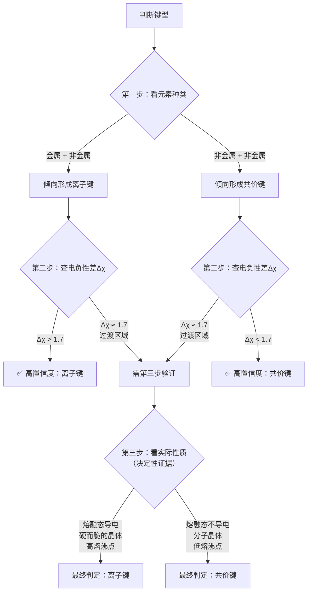

# 1

讲解高中化学知识

- h2 分子, h 得到了 e- 还是付出了

---

好的，这是一个非常核心的高中化学概念！我们来详细讲解一下。

对于 **H₂ 分子（氢气分子）** 中的氢原子，它**既不能说是“得到了”电子，也不能说是“付出了”电子**。更准确的说法是：**两个氢原子各提供一个电子，形成一个共用电子对。**

下面我们从几个层面来深入理解：

### 1. 核心概念：共价键

H₂ 分子的形成是典型的**共价键**。

- **背景知识**：每个氢原子 (H) 的原子核内有 1 个质子，核外有 1 个电子。它的最外层电子层（K 层）的容量是 2 个电子。为了达到像稀有气体（氦，He）那样稳定的 2 电子结构，氢原子需要“再获得”1 个电子。
- **困境**：两个氢原子都想从对方那里“抢”一个电子来填满自己的电子层，但它们对电子的吸引力（即电负性）是**完全相同**的。谁也无法从对方那里抢走电子。
- **解决方案**：它们选择“共享”。每个氢原子各拿出自己唯一的 1 个电子，让这一对电子在两个原子核的周围空间**共同运动**。这样，对于每个氢原子来说，都仿佛拥有了 2 个电子的稳定结构。

**打个比方**：
想象两个好朋友，每人只有一块钱，都买不起一瓶两块钱的水。于是他们决定**共同拥有**这两块钱，然后一起买下这瓶水分享。在这个过程中，没有谁“失去”或“得到”钱，而是通过“共享”实现了共同的目标。

### 2. 与离子键的对比（帮助你更好理解）

为了更好地理解“共用”，我们来看一个“得到/付出”电子的例子——**离子键**，比如 **NaCl（氯化钠）**。

- **钠原子 (Na)**：最外层有 1 个电子，它非常容易**失去**这个电子，形成带正电的 Na⁺ 离子。
- **氯原子 (Cl)**：最外层有 7 个电子，它非常渴望**得到**1 个电子，形成带负电的 Cl⁻ 离子。
- **成键过程**：钠原子将自己的最外层电子**付出**给氯原子，氯原子**得到**了这个电子。然后，靠正负电荷之间的静电吸引力（库仑力）结合在一起。

**关键区别**：
| 键型 | 形成微粒 | 电子行为 | 举例 |
| :--- | :--- | :--- | :--- |
| **共价键** | 原子 | **共用**电子对 | H₂, H₂O, CO₂ |
| **离子键** | 离子 | **得失**电子（电子转移） | NaCl, KBr |

所以，对于 H₂ 来说，电子是**共用**的，不存在单个原子的“得失”。

### 3. 电子云重叠模型（更形象的现代观点）

在现代化学中，我们用电子云来描述原子轨道。当两个氢原子相互靠近时：

1.  它们各自的 1s 原子轨道（像一个球形的电子云）会发生**重叠**。
2.  重叠区域的电子云密度增大。
3.  这对高密度的、共用的电子云，同时受到两个原子核的吸引，产生强大的力量将两个原子核“拉”在一起，从而形成了稳定的 H₂ 分子。

这个重叠的区域，就是**共价键**的实质。

### 总结

- **H₂ 分子中的氢原子没有“得到”或“付出”电子。**
- 它们是通过**形成共价键**，**共用一对电子**而结合在一起的。
- 这种共用使得每个氢原子都达到了 2 电子的稳定结构。
- “得到/付出”电子是**离子键**的典型特征，发生在电负性相差较大的原子之间（如金属和非金属）。

希望这个解释能帮助你彻底理解这个问题！这是高中化学非常基础且重要的一个分水岭，理解了共价键和离子键的区别，后续学习分子结构、性质等内容就会轻松很多。

# 2

对于 hcl 呢

---

非常好！这个问题能帮助我们深入理解共价键的复杂性和“电负性”这个概念。

对于 **HCl（氯化氢）分子**，情况比 H₂ 要复杂一些。结论是：

**氢原子（H）部分地“付出”了电子，氯原子（Cl）部分地“得到”了电子，但这个过程并非完全的电子转移，而是形成了一个极性共价键。**

下面我们来详细分解：

### 1. 核心概念：极性共价键

HCl 的形成也是**共价键**，但它不是像 H₂ 那样“公平”的共价键，而是一个**极性共价键**。

- **关键因素：电负性**

  - **电负性**是原子吸引共用电子对能力大小的标度。
  - 在元素周期表中，**氯 (Cl) 的电负性 (3.16) 远大于氢 (H) 的电负性 (2.20)**。

- **成键过程**：
  1.  和 H₂ 一样，氢原子和氯原子各提供一个电子，形成一个**共用电子对**。
  2.  但是，由于氯原子对电子的“吸引力”更强，**共用电子对会强烈地偏向氯原子一方**。
  3.  结果就是，电子云在氯原子核周围分布的密度更大，而在氢原子核周围分布的密度更小。

**打个比方**：
继续用朋友的比喻：现在是一个力气大的人（Cl）和一个力气小的人（H）共用这两块钱。虽然钱在法律上是“共同拥有”的，但实际控制权在力气大的人手里。力气小的人感觉像是“部分失去”了钱，而力气大的人感觉像是“部分得到”了钱。

### 2. 分子的极性与部分电荷

由于电子云的不均匀分布，导致了 HCl 分子带电不均：

- 电子云偏向氯，使得氯原子一端带部分负电荷，记作 **δ⁻** (delta minus)。
- 氢原子一端电子云密度减小，相当于原子核的正电荷没有被完全屏蔽，因此带部分正电荷，记作 **δ⁺** (delta plus)。

这样一个正电荷中心和负电荷中心不重合的分子，我们称之为**极性分子**。

`H — Cl`
`δ⁺    δ⁻`
_(“—” 代表共价键，δ 代表部分电荷)_

### 3. 与 H₂ 和 NaCl 的对比（光谱）

为了更好地理解，我们把 H₂、HCl 和 NaCl 放在一个光谱上看：

| 特性         | **H₂ (氢气)**     | **HCl (氯化氢)**        | **NaCl (氯化钠)**      |
| :----------- | :---------------- | :---------------------- | :--------------------- |
| **成键类型** | **共价键**        | **极性共价键**          | **离子键**             |
| **电负性差** | Δχ = 0 (完全相同) | Δχ = 0.96 (差异明显)    | Δχ = 2.23 (差异巨大)   |
| **电子分布** | **均匀共用**      | **不均匀共用**，偏向 Cl | **完全转移**，Na 给 Cl |
| **电荷分布** | 分子无极性        | 分子有极性 (H⁺δ–Cl⁻δ)   | 形成离子 (Na⁺ 和 Cl⁻)  |
| **键的实质** | 共用电子对        | 共用但偏移的电子对      | 阴阳离子静电作用       |

**结论光谱**：
**非极性共价键 (H₂) ←--- 极性共价键 (HCl) ---→ 离子键 (NaCl)**
这是一个连续过渡的过程，HCl 处于中间状态。

### 总结与升华

- **对于 HCl 中的 H 原子**：它没有像 NaCl 中的 Na 那样完全失去电子，但由于共用电子对被 Cl 原子强烈吸引，可以认为它**部分付出了电子**，导致了自身带部分正电 (δ⁺)。
- **核心驱动力**：**电负性差**决定了化学键的类型和极性大小。
  - 电负性差 ≈ 0：**非极性共价键** (如 H₂, O₂)
  - 电负性差 介于 0 和 ~1.7 之间：**极性共价键** (如 HCl, H₂O)
  - 电负性差 > ~1.7：**离子键** (如 NaCl, KF)

所以，回答你的问题“对于 HCl 呢？”：H 原子是电子云的“弱势方”，它付出了对共用电子对的“控制权”，从而带上了部分正电荷。这是一个经典的极性共价键例子，也是理解分子极性和很多物质性质（如溶解性、酸性）的基础。

# 3

为什么 hcl 共价, nacl 离子

---

这是一个非常核心的问题，它触及了化学键理论的本质。HCl 和 NaCl 之所以形成不同类型的化学键，核心原因在于**形成化合物的两种原子之间的电负性差值**不同。

我们可以用一个简单的比喻来开始：

- **HCl** 像两个朋友**共享**一份财产，虽然一方控制得多一些（极性共价键）。
- **NaCl** 像一个人直接把钱**送给**另一个人，然后他们靠债权关系联系在一起（离子键）。

下面我们从原子结构的角度进行详细解释。

### 核心原理：电负性差

**电负性**是原子在分子中吸引共用电子对能力的标度。

- **电负性差值（Δχ）** 是判断键型的关键：
  - **Δχ ≈ 0**：非极性共价键（如 H-H）
  - **0 < Δχ ≲ 1.7**：极性共价键（如 H-Cl）
  - **Δχ > 1.7**：离子键（如 Na-Cl）

---

### 1. 为什么 HCl 是共价键？

让我们看看氢（H）和氯（Cl）的情况：

- **氢 (H)**：

  - 核外有 1 个电子，希望再获得 1 个电子以达到 2 电子的稳定结构（像氦）。
  - 电负性 **χ = 2.20**

- **氯 (Cl)**：

  - 核外有 7 个价电子，希望再获得 1 个电子以达到 8 电子的稳定结构（像氩）。
  - 电负性 **χ = 3.16**

- **成键分析**：
  1.  **需求相同**：它们都“想要”1 个电子，但谁也无法轻易地从对方那里抢走电子。
  2.  **电负性差**：Δχ = 3.16 - 2.20 = **0.96**。这个差值**小于 1.7**，属于典型的极性共价键范围。
  3.  **解决方案**：最有效的方式是**各出 1 个电子，形成一个共用电子对**。通过共享，氢原子“感觉”自己拥有了 2 个电子，氯原子“感觉”自己拥有了 8 个电子，都达到了稳定结构。
  4.  **键的极性**：由于氯的电负性更强，共用电子对会**偏向**氯原子一方，导致氯原子一端带部分负电荷（δ⁻），氢原子一端带部分正电荷（δ⁺）。所以这是一个**极性共价键**。

**结论**：HCl 是共价键，因为双方对电子的争夺势均力敌（差值不大），只能通过“共享”来解决问题，但力量稍强的氯获得了电子对的“控制权”。

---

### 2. 为什么 NaCl 是离子键？

现在我们看看钠（Na）和氯（Cl）的情况：

- **钠 (Na)**：

  - 核外电子排布是 2-8-1，最外层只有 1 个电子。
  - 它如果**失去**这 1 个电子，就能露出内层的 8 电子稳定结构（像氖）。失去这个电子对它来说**非常容易**（电离能很低）。
  - 电负性 **χ = 0.93**（非常低，意味着它几乎不想留住自己的电子）。

- **氯 (Cl)**：

  - 和上面一样，它非常渴望**得到**1 个电子以达到 8 电子稳定结构。
  - 电负性 **χ = 3.16**（非常高，意味着它非常想抢夺电子）。

- **成键分析**：
  1.  **“一个愿打，一个愿挨”**：钠原子迫切想失去电子，氯原子迫切想得到电子。这是一个完美的“供需关系”。
  2.  **电负性差**：Δχ = 3.16 - 0.93 = **2.23**。这个差值**远大于 1.7**，属于典型的离子键范围。
  3.  **解决方案**：钠原子直接将其最外层的 1 个电子**完全转移**给氯原子。
      - 钠原子失去 1 个电子，变成带正电的**阳离子（Na⁺）**。
      - 氯原子得到 1 个电子，变成带负电的**阴离子（Cl⁻）**。
  4.  **键的实质**：靠正离子（Na⁺）和负离子（Cl⁻）之间的静电吸引力（库仑力）结合在一起。这就是**离子键**。

**结论**：NaCl 是离子键，因为一方（Na）极易失去电子，另一方（Cl）极易得到电子，电负性差异巨大，导致了电子的**完全转移**而非共享。

---

### 总结对比

| 特性              | **HCl (氯化氢)**                | **NaCl (氯化钠)**              |
| :---------------- | :------------------------------ | :----------------------------- |
| **成键原子**      | 非金属 (H) + 非金属 (Cl)        | 金属 (Na) + 非金属 (Cl)        |
| **电负性差 (Δχ)** | **0.96** （较小）               | **2.23** （巨大）              |
| **电子行为**      | **不均匀共用**（电子对偏向 Cl） | **完全转移**（Na 的电子给 Cl） |
| **形成微粒**      | **HCl 分子**                    | **Na⁺ 离子和 Cl⁻ 离子**        |
| **键的类型**      | **极性共价键**                  | **离子键**                     |
| **物质状态**      | 常温下为**气体**                | 常温下为**固体**               |

简单来说，**电负性相差不大的非金属原子之间通常形成共价键，而电负性相差巨大的金属和非金属原子之间通常形成离子键。** 这个规律是理解和判断化学键类型的最重要工具。

# 4

为什么是电负性决定付出得到, 对于 hcl. 而不是 h 有一个, 付出就稳定. cl 有 7 个, 得到一个稳定.

---

您这个问题问得极其深刻，直击了化学键理论的核心！您提出的思路——“H 付出一个就稳定，Cl 得到一个就稳定，所以应该转移”——从“达到稳定结构”的需求上看，是完全合理的。但这只是故事的一半。

**问题的关键在于：达到稳定结构是有“成本”的。而电负性，就是衡量这个“成本”和“收益”的标尺。**

让我们来一步步拆解这个精妙的博弈过程。

### 1. 您的思路：为什么“看似可行”？

您的逻辑是：

- **H**：失去 1 个 e⁻ → 变成 H⁺（没有电子，但核外已无电子，可视为一种稳定？）
- **Cl**：得到 1 个 e⁻ → 变成 Cl⁻（八电子稳定结构）

从结果上看，似乎确实形成了一个正离子和一个负离子，应该靠离子键结合。这个推理在只考虑“最终状态”时是成立的。

### 2. 关键矛盾：H⁺ 真的稳定吗？

这里就是第一个，也是最核心的误区：**H⁺ 是一个极其不稳定、能量极高、在化学上几乎无法独立存在的物种。**

- **H⁺** 本质上就是一个**裸露的质子**。它体积极小，正电荷高度集中，具有极强的吸引电子的能力。
- 让它单独存在，就像把一颗磁力极强的磁铁悬在空中，它会不惜一切代价去抓取一个电子来稳定自己。这个“代价”就是释放巨大的能量。
- 因此，**将 H 变成 H⁺ 需要耗费巨大的能量（电离能），而生成的 H⁺ 本身又极不稳定**。这条路是条“高成本、低收益”的绝路。

### 3. 更好的解决方案：共价共享

既然电子完全转移给 Cl，让 H 变成“光杆司令”H⁺ 行不通，那有没有一个“双赢”的方案呢？

有，那就是**共价共享**。

- **过程**：H 和 Cl 各出一个电子，形成一对**共用电子对**。
- **结果**：
  - 对于 **Cl**：通过共用，它感觉自己拥有了 8 个电子（自己的 7 个 + 共享的 1 个），达到了稳定结构。
  - 对于 **H**：通过共用，它感觉自己拥有了 2 个电子（自己的 1 个 + 共享的 1 个），也达到了稳定结构（像 He）。
- **优势**：**没有人变成能量极高的 H⁺**。这是一个让双方都能以较低能量成本达到稳定状态的方案。

### 4. 电负性的作用：决定“共享的公平性”

现在，共用电子对形成了。但这对电子在 H 和 Cl 之间是“公平”的吗？**这就是电负性出场的时候了。**

- **电负性（χ）**：原子在分子中**吸引共用电子对**的能力。

  - Cl 的 χ = 3.16
  - H 的 χ = 2.20

- **作用**：因为 Cl 对电子的吸引力更强，所以共用电子对会被**拉向 Cl 的一方**，但**并没有被 Cl 完全夺走**。
- **结果**：电子云在 Cl 周围更密集，在 H 周围更稀疏。这使得：
  - Cl 一端带部分负电荷（δ⁻）
  - H 一端带部分正电荷（δ⁺）

**这就形成了极性共价键。**

### 总结与升华：能量决定论

我们可以用一个经济学类比来总结：

- **您的方案（离子键）**：H 公司破产清算（失去电子变成 H⁺），将所有资产（电子）贱卖给 Cl 公司。虽然 Cl 公司壮大了（变成稳定的 Cl⁻），但 H 公司倒闭的代价太高，整个社会（分子体系）总成本巨大，不划算。
- **实际的方案（共价键）**：H 公司和 Cl 公司**合资**（共用电子对）成立一个新项目（HCl 分子）。虽然 Cl 公司出资能力强、占的股份多（电子对偏向 Cl），但 H 公司也得以存活并盈利（达到稳定）。这是一个**总能量最低、最稳定**的双赢方案。

**所以，最终的答案是：**

**“达到稳定结构”是原子成键的【驱动力】，而“电负性”是决定通过何种【路径】（离子键还是共价键）来实现这个驱动力的【判据】。这个判据的背后，是自然界追求【体系总能量最低】这一根本法则。**

对于 H 和 Cl，虽然从表面需求上看电子转移可以满足稳定，但因此创造出的 H⁺ 能量太高，导致**总体系能量反而升高**。而通过电负性更强的 Cl 来不公平地“共享”电子，既能满足双方的稳定需求，又避免了生成高能量的 H⁺，从而使**总体系能量降到最低**——这才是自然选择的、真正发生的路径。

希望这个解释能帮您打通这个关键节点！

# 5

电负性差值, 用了好多约等于. 如何准确判断

---

您指出了一个非常关键的点！化学中确实存在很多“约等于”和经验规则，这是因为化学键的本质是连续的，而非断然二分的。所谓的“Δχ = 1.7”是一个非常有用的**经验临界值**，而不是一个绝对的物理定律。

那么，如何更“准确”地判断呢？我们可以建立一个更严谨的判断流程，从定性到定量，从理论到实验。

### 一、 理解“1.7”这个数字的由来

这个值来源于化学家莱纳斯·鲍林对键能的计算。他发现，当两种原子的电负性差值达到约 1.7 时，键的**离子性百分比**约为 50%。人们约定俗成地认为，当离子性超过 50%时，这个键就可以被看作是“离子键”了。

但这只是一个方便的、人为的界限。现实是一个**连续谱**：

- **Δχ = 0** (如 H₂): 0% 离子性 → **纯共价键**
- **0 < Δχ < ~1.7** (如 HCl, Δχ=0.96): ~20% 离子性 → **极性共价键**
- **Δχ ≈ 1.7** (如 AgF): ~50% 离子性 → **过渡区域**
- **Δχ > ~1.7** (如 NaCl, Δχ=2.23): ~70% 离子性 → **离子键**

所以，第一步是接受这个概念的连续性。

### 二、 更准确的综合判断流程

不要只依赖一个数字。我们可以通过以下流程图，结合多种证据进行综合判断，这会准确得多：

下面我们来详细解释流程图中的三个关键步骤：

**第一步：定性判断——元素组合**
这是最快速的方法。

- **典型的离子键**：**活泼金属（IA， IIA 族）** + **活泼非金属（VIA， VIIA 族）**。
  - 例如：NaCl, KBr, CaO, MgCl₂。这些组合几乎总是形成离子键，它们的 Δχ 通常远大于 1.7。
- **典型的共价键**：**非金属** + **非金属**。
  - 例如：CO₂, H₂O, CH₄, Cl₂。这些组合总是形成共价键。

**第二步：定量判断——电负性差**
使用鲍林电负性表计算 Δχ。

- **Δχ > 1.7**：强烈指示**离子键**。
- **Δχ < 1.7**：强烈指示**共价键**（非极性或极性）。
- **Δχ ≈ 1.7 (例如 1.5 - 1.9)**：**灰色区域**，无法单凭此判断，必须进入第三步。

**第三步：决定性验证——物质的物理性质**
这是判断键型的“实验证据”，也是最可靠的依据。

| 性质             | **离子化合物**                       | **共价化合物**                             |
| :--------------- | :----------------------------------- | :----------------------------------------- |
| **熔融态导电性** | **✅ 导电**（存在自由移动的离子）    | **❌ 不导电**（存在的是分子，无离子）      |
| **晶体结构**     | 离子晶体，硬而脆                     | 分子晶体（大多数），软                     |
| **熔沸点**       | 通常**很高**（需要克服很强的离子键） | 通常**较低**（只需克服较弱的分子间作用力） |
| **在水中溶解性** | 大多易溶，形成水合离子               | 情况多样，但通常不导电                     |

---

### 三、 实战应用：解决灰色区域问题

让我们用这个流程来判断一个经典灰色区域物质：**三氧化二铝 (Al₂O₃)**。

1.  **第一步：元素组合**

    - Al 是**金属**，O 是**非金属**。⇒ **初步倾向：离子键**。

2.  **第二步：电负性差**

    - χ(Al) = 1.61, χ(O) = 3.44
    - Δχ = 3.44 - 1.61 = **1.83**
    - 这个值在 1.7 附近，属于**灰色区域**。无法下定论。

3.  **第三步：看性质**
    - **熔点**：极高，约 2072°C。⇒ **符合离子化合物特征**。
    - **熔融态导电性**：熔融的 Al₂O₃ 可以导电（这正是工业上电解法制备铝的原理）。⇒ **这是决定性证据！**
    - **硬度**：非常高（刚玉，红宝石/蓝宝石）。⇒ **符合离子晶体特征**。

**结论**：尽管 Δχ 在边界上，但其**熔融导电**的性质无可辩驳地证明，Al₂O₃ 中的化学键是**离子键**。

### 总结

如何“准确”判断？

1.  **首选方法**：记住**活泼金属+活泼非金属 ⇒ 离子键**，**非金属+非金属 ⇒ 共价键**。这能解决 95%的高中问题。
2.  **遇到模糊情况**：计算**电负性差**。如果 Δχ > 2.0，基本肯定是离子键；如果 Δχ < 1.0，基本肯定是共价键。
3.  **遇到边界情况 (Δχ ≈ 1.7)**：寻找**决定性实验证据**，尤其是**熔融态是否导电**。这是区分离子化合物和共价化合物的“金标准”。

通过这种“**定性初判 → 定量估算 → 性质验证**”的综合思路，您就可以非常准确且自信地判断化学键的类型了。
