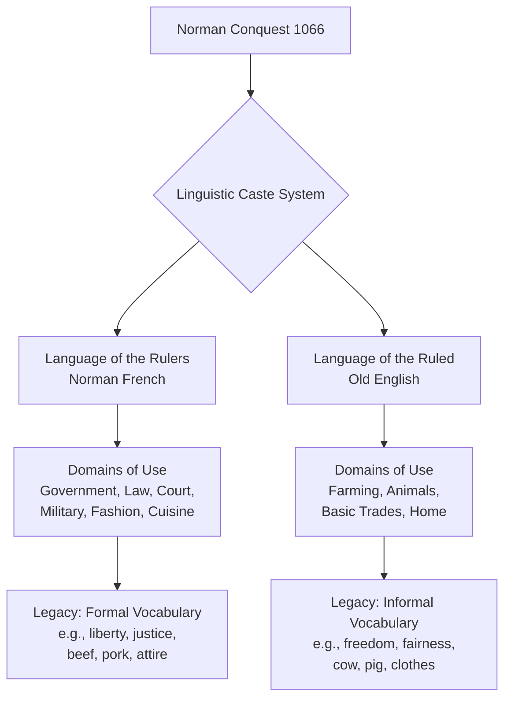
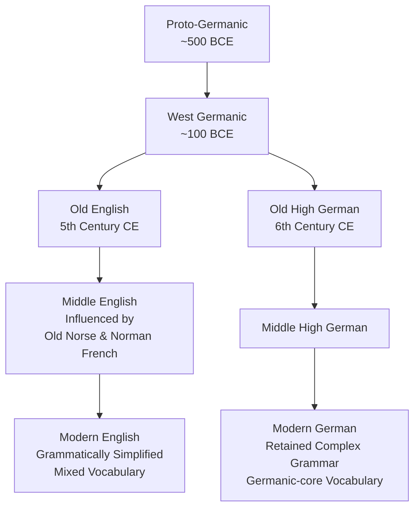

# 1

compare formal and informal english

---

Of course. Here is a detailed comparison of Formal and Informal English, broken down by key characteristics.

### At a Glance: The Core Difference

- **Formal English:** Used in serious, official, or professional contexts. It is impersonal, precise, and follows standard grammar rules strictly.
- **Informal English:** Used in casual, personal, or familiar contexts. It is personal, relaxed, and often sounds like everyday conversation.

---

### Detailed Comparison Table

| Feature                          | Formal English                                                                                                                                                                                          | Informal English                                                                                                                                                                              |
| :------------------------------- | :------------------------------------------------------------------------------------------------------------------------------------------------------------------------------------------------------ | :-------------------------------------------------------------------------------------------------------------------------------------------------------------------------------------------- |
| **Context & Usage**              | Academic writing (essays, theses), official reports, business proposals, legal documents, official speeches, news broadcasts.                                                                           | Personal emails, text messages, social media, casual conversations, friendly letters, creative writing (dialogue).                                                                            |
| **Structure & Grammar**          | - Uses complex sentences with subordinate clauses. - Avoids contractions (e.g., **cannot** instead of _can't_). - Strict adherence to grammar rules.                                              | - Uses simpler, shorter, or fragmented sentences. - Frequently uses contractions (e.g., _don't_, _it's_, _won't_). - More tolerant of grammatical flexibility.                          |
| **Vocabulary & Wording**         | - Prefers Latinate vocabulary (e.g., **investigate**, **require**, **terminate**). - Avoids phrasal verbs where possible (e.g., **tolerate** instead of _put up with_). - Impersonal and precise. | - Uses simpler, shorter, often Germanic-root words (e.g., **ask**, **buy**, **end**). - Common use of phrasal verbs (e.g., _find out_, _go on_, _look into_). - Personal and emotional. |
| **Contractions & Abbreviations** | Avoids them. Writes words in full.                                                                                                                                                                      | Uses them frequently.                                                                                                                                                                         |
| **Voice & Pronouns**             | - Often uses the passive voice to sound objective (e.g., "The experiment was conducted..."). - Avoids first-person pronouns (I, we) and second-person (you).                                         | - Prefers the active voice (e.g., "We did the experiment..."). - Frequently uses **I**, **we**, and **you**.                                                                               |
| **Slang & Idioms**               | Avoids slang, clichés, and idiomatic expressions.                                                                                                                                                       | Commonly uses slang (e.g., _cool_, _ghosting_), idioms (e.g., _hit the books_), and filler words (e.g., _like_, _well_, _you know_).                                                          |

---

### Key Differences Explained with Examples

#### 1. Vocabulary and Phrasal Verbs

This is one of the most noticeable differences.

| Concept              | Formal                                           | Informal                                         |
| :------------------- | :----------------------------------------------- | :----------------------------------------------- |
| **To Explore**       | **The company will investigate** the issue.      | The company will **look into** the issue.        |
| **To Continue**      | **The meeting will continue** after the break.   | The meeting will **go on** after the break.      |
| **To Raise a Child** | **Children are raised** in various environments. | Kids are **brought up** in various environments. |

#### 2. Pronouns and Voice

- **Formal (Impersonal):** "It is recommended **that the board approve** the proposal." (Passive voice, no "you")
- **Informal (Personal):** "**I think you should** approve the proposal." (Active voice, uses "I" and "you")

- **Formal:** "**One must consider** the consequences." (Uses "one")
- **Informal:** "**You have to think about** what will happen." (Uses "you")

#### 3. Sentence Structure and Contractions

- **Formal:** "The committee **has not** yet **reached** a decision regarding the matter, **which is** currently under review." (No contractions, complex sentence)
- **Informal:** "The committee **hasn't decided** yet. **They're** still **looking into it**." (Contractions, simpler sentences, phrasal verb)

---

### Side-by-Side Example

Imagine you need to ask someone to return a book.

- **Formal (in an email to a professor):**

  > "Dear Professor Smith,
  >
  > I am writing to request the return of the book, _'Principles of Linguistics,'_ which I lent to you last month. I require it for my research.
  >
  > Sincerely,
  > John Doe"

- **Informal (in a text to a friend):**
  > "Hey, can I get that linguistics book back when you get a chance? I need it for my paper. Thanks!"

### Why the Difference Matters

Using the appropriate register is a key part of your communication skills.

- **Using formal language** in a casual context can make you sound stiff, unfriendly, or pompous.
- **Using informal language** in a formal context can make you seem unprofessional, disrespectful, or unprepared.

**In summary:** Choose **Formal English** when you need to be professional, respectful, or objective. Choose **Informal English** when you are communicating with friends, family, or in other relaxed situations where the goal is connection and ease.

# 2

write a detailed comparison

---

Of course. Here is a detailed and comprehensive comparison of Formal and Informal English.

### **Defining Formal and Informal English**

At its core, the difference between formal and informal English is the difference between a tailored suit and a comfortable t-shirt. Both have their place, but choosing the wrong one for the occasion can lead to awkwardness or misunderstanding. This distinction is known as **register**—the level of formality appropriate to a specific context, audience, and purpose.

- **Formal English** is characterized by its structured, impersonal, and precise nature. It adheres strictly to the conventions of standard grammar and is used in contexts that require professionalism, objectivity, and authority.
- **Informal English** is characterized by its conversational, personal, and relaxed nature. It mirrors everyday speech, is more flexible with grammatical rules, and is used in contexts of familiarity and personal connection.

---

### **A Detailed Comparison by Feature**

#### **1. Context and Purpose**

| Feature              | Formal English                                                                                                                                                                                                              | Informal English                                                                                                                                                         |
| :------------------- | :-------------------------------------------------------------------------------------------------------------------------------------------------------------------------------------------------------------------------- | :----------------------------------------------------------------------------------------------------------------------------------------------------------------------- |
| **Primary Goal**     | To inform, persuade, or demonstrate authority and professionalism in a serious context.                                                                                                                                     | To communicate, connect, and build relationships in a casual context.                                                                                                    |
| **Typical Settings** | Academic writing (theses, journals), legal documents (contracts, laws), official reports, business communications (proposals, corporate emails), technical documentation, official speeches (e.g., a presidential address). | Personal emails and letters, text messages, social media posts, casual conversations with friends and family, creative writing (for character dialogue), personal blogs. |
| **Audience**         | Authority figures (professors, bosses), professionals, the public in an official capacity, or an unknown reader.                                                                                                            | Friends, family, peers, and close colleagues in a non-professional setting.                                                                                              |

#### **2. Grammar and Structure**

| Feature                 | Formal English                                                                                                                           | Informal English                                                                                           |
| :---------------------- | :--------------------------------------------------------------------------------------------------------------------------------------- | :--------------------------------------------------------------------------------------------------------- |
| **Sentence Structure**  | Favors complex sentences with subordinate clauses to show the relationship between ideas. Sentences are often longer and more intricate. | Uses simpler, shorter sentences. Sentence fragments are common and acceptable for effect.                  |
| **Contractions**        | **Avoided almost entirely.** Words are written in full. (e.g., **do not**, **cannot**, **it is**, **they are**).                         | **Used frequently.** Contractions are the norm. (e.g., _don't_, _can't_, _it's_, _they're_).               |
| **Relative Pronouns**   | Prefers **whom** as the object of a verb or preposition. (e.g., "The person **to whom** you spoke...").                                  | Almost universally uses **who** for both subject and object. (e.g., "The person **who** you spoke to..."). |
| **Prepositions at End** | Often restructures sentences to avoid ending a sentence with a preposition. (e.g., "About which problem are you speaking?")              | Commonly ends sentences with prepositions. (e.g., "What problem are you speaking **about**?")              |

**Example:**

- **Formal:** "The data **that** were collected for the study, **which** was conducted over three years, are significant." (Complex, uses "that" for things, avoids preposition at end).
- **Informal:** "The data they collected for the study is significant. It took three years." (Simple, sentence fragment, preposition "for" ends the first implied clause).

#### **3. Vocabulary and Word Choice**

This is one of the most telling differentiators.

| Feature                      | Formal English                                                                                                                                                                               | Informal English                                                                                                                                             |
| :--------------------------- | :------------------------------------------------------------------------------------------------------------------------------------------------------------------------------------------- | :----------------------------------------------------------------------------------------------------------------------------------------------------------- |
| **Word Origin**              | Heavily prefers **Latinate** vocabulary (words derived from French and Latin). These words are often longer and more abstract. (e.g., **ascertain**, **utilize**, **commence**, **reside**). | Prefers **Germanic** vocabulary (native English words). These are often shorter, more direct, and more physical. (e.g., _find out_, _use_, _start_, _live_). |
| **Phrasal Verbs**            | **Avoids** multi-word verbs. Replaces them with a single, more formal verb.                                                                                                                  | **Relies heavily** on phrasal verbs.                                                                                                                         |
| **Slang and Idioms**         | **Strictly avoided.** Considered imprecise and unprofessional.                                                                                                                               | **Commonly used.** Adds color and cultural relevance. (e.g., _"ghosting," "throw shade," "hit the books"_).                                                  |
| **Abbreviations & Acronyms** | Spells out terms fully on first use, followed by the acronym in parentheses. Avoids chat acronyms.                                                                                           | Uses chat acronyms freely (LOL, BTW, IMHO). Shortens common phrases ("info" for information, "pic" for picture).                                             |

**Vocabulary Comparison Table:**

| Meaning            | Formal Equivalent              | Informal Equivalent         |
| :----------------- | :----------------------------- | :-------------------------- |
| **To Find Out**    | **Investigate**, **ascertain** | _Look into_, _find out_     |
| **To Put Up With** | **Tolerate**, **endure**       | _Put up with_               |
| **To Get Better**  | **Improve**, **recuperate**    | _Get better_, _bounce back_ |
| **To Think About** | **Consider**, **contemplate**  | _Think about_, _mull over_  |
| **To Ask For**     | **Request**                    | _Ask for_                   |

#### **4. Voice and Perspective**

| Feature                      | Formal English                                                                                                                                         | Informal English                                                                         |
| :--------------------------- | :----------------------------------------------------------------------------------------------------------------------------------------------------- | :--------------------------------------------------------------------------------------- |
| **Personal Pronouns**        | Avoids first-person (**I, we**) and second-person (**you**) to maintain objectivity and formality. Often uses the third person or passive voice.       | Freely uses **I, we, you, my, our**. This creates a direct, personal, and engaging tone. |
| **Voice**                    | Uses the **passive voice** more frequently to focus on the action or the result rather than the person performing it. This creates an impersonal tone. | Strongly prefers the **active voice**, which is more direct and vigorous.                |
| **Impersonal Constructions** | Uses constructions like "It is believed that..." or "One must consider..." to state general beliefs or rules.                                          | States beliefs directly: "I think that..." or "You should consider..."                   |

**Example:**

- **Formal (Impersonal, Passive):** "The decision **was made** to terminate the project. **It is recommended that** the team be reassigned." (Hides who decided/recommended).
- **Informal (Personal, Active):** "**We decided** to end the project. **I think you should** reassign the team." (Clear who is acting).

---

### **Illustrative Side-by-Side Examples**

**Scenario 1: Apologizing for a Missed Deadline**

- **Formal (Email to a Client):**

  > "Dear Mr. Jones,
  >
  > Please accept my sincerest apologies for the delay in submitting the quarterly report. Unforeseen complexities arose during the data compilation phase, which necessitated a more thorough analysis than was initially anticipated. We assure you that we are according this matter the highest priority and anticipate delivering the completed document by close of business tomorrow.
  >
  > Sincerely,
  > Jane Doe"

- **Informal (Email to a Colleague):**
  > "Hey Sam,
  >
  > So sorry I'm late with the report! The data was a total mess and took way longer to sort out than I thought. I'm really slammed but promise I'll get it to you by tomorrow EOD.
  >
  > Thanks for your patience!
  > Jane"

**Scenario 2: Expressing an Opinion**

- **Formal (Academic Paper):**
  > "The evidence appears to substantiate the hypothesis that socioeconomic factors are a primary determinant in educational attainment. Consequently, it is imperative that policy interventions are designed to address these underlying disparities."
- **Informal (Conversation):**
  > "I think where you grow up and how much money your family has really affects how far you get in school. So if we want to fix things, we've got to tackle that problem first."

---

### **Why the Distinction Matters: The Consequences of Getting it Wrong**

- **Using Informal English in a Formal Context:**

  - **Perception:** You may be seen as unprofessional, uneducated, disrespectful, or lazy.
  - **Impact:** A job application may be rejected, a business proposal may not be taken seriously, or a grade may be lowered.

- **Using Formal English in an Informal Context:**
  - **Perception:** You may come across as cold, pompous, arrogant, or awkward.
  - **Impact:** You might struggle to build rapport with colleagues, seem unapproachable to friends, or write marketing copy that fails to connect with its audience.

### **Conclusion: A Spectrum, Not a Binary**

While formal and informal English are often presented as opposites, it's more accurate to think of them as two ends of a spectrum. A business email to a friendly colleague might be "semi-formal"—more structured than a text message but warmer than a corporate report. The key to effective communication is developing the sensitivity to assess the context, audience, and purpose, and then selecting the appropriate register along that spectrum. Mastering both allows you to navigate the world with both competence and connection.

# 3

explain the grammatical flexibility of informal english

---

Of course. This is an excellent question that gets to the heart of how spoken language naturally evolves. The grammatical flexibility of Informal English is not about being "wrong," but about prioritizing communication efficiency, rapport, and emotional expression over strict grammatical rules.

Here is a detailed explanation of the key areas where Informal English exhibits grammatical flexibility.

### 1. The "Malleable" Sentence

Formal English requires complete, well-structured sentences. Informal English often breaks this mold.

- **Sentence Fragments:** Using incomplete sentences where the meaning is clear from context.

  - **Formal:** "Are you going to the store later?"
  - **Informal:** "Going to the store later?" (Fragment omitting "Are you")
  - **Formal:** "That sounds like a wonderful idea."
  - **Informal:** "Awesome idea!" (Fragment omitting the subject and verb)

- **Run-on Sentences and Comma Splices:** Connecting related thoughts with commas or no punctuation at all to mimic the flow of speech.
  - **Formal:** "I wanted to go; however, it started to rain."
  - **Informal:** "I wanted to go, but then it started to rain, so we just stayed in." (Comma splice connecting multiple clauses)
  - **Informal:** "I saw him and I waved but he didn't see me." (No comma before "but")

### 2. Pronoun Flexibility

Informal English often uses pronouns in ways that formal grammar prohibits, largely because the referent is usually clear to the listener.

- **Using "Me" as a Subject:** In coordinated subjects, "and me" is often used instead of "and I."

  - **Formal:** "My brother and **I** went to the movies."
  - **Informal:** "**Me and my brother** went to the movies." (While often taught as "incorrect," this is ubiquitous in casual speech.)

- **Using "They" as a Singular Pronoun:** This has two key uses:

  1.  **As a Singular Generic Pronoun:** To refer to a single person of unspecified gender.
      - **Formal:** "If **a user** has a problem, **he or she** should contact support."
      - **Informal:** "If **someone** has a problem, **they** should contact support."
  2.  **As a Personal Pronoun:** To refer to a specific person who identifies as non-binary.
      - "I met Sam today. **They** said **they'll** be there."

- **Dropping Relative Pronouns:** Omitting pronouns like "who," "that," or "which."
  - **Formal:** "This is the book **that** I was telling you about."
  - **Informal:** "This is the book I was telling you about."

### 3. Verb Conjugation and Tense Simplification

Verbs are often simplified or used in non-standard ways to make speech quicker and more fluid.

- **"Ain't":** A famous informal contraction that can stand in for "am not," "is not," "are not," "has not," and "have not."

  - "I **ain't** going." (I am not going)
  - "He **ain't** got any." (He hasn't got any)

- **Simplified Subjunctive Mood:** The subjunctive mood (used for hypotheticals) is often replaced with simpler forms.

  - **Formal:** "I wish I **were** there." (Subjunctive)
  - **Informal:** "I wish I **was** there." (Simple past)

- **Non-Standard Past Tense Forms:** Using colloquial or regional past participles.
  - **Formal:** "I have **gone**." / "It has **sunk**."
  - **Informal:** "I have **went**." / "It has **sank**."

### 4. Question Formation

Informal questions often skip the formal inversion of the subject and auxiliary verb.

- **Formal:** "Could you pass me the salt?"
- **Informal:** "You gonna pass the salt?" (Omitting the auxiliary "are" and using the contraction "gonna" for "going to")
- **Formal:** "Do you know what time it is?"
- **Informal:** "You know what time it is?" (Statement intonation used to ask a question)

### 5. Preposition Placement and Choice

As mentioned in the previous comparison, informal English famously allows prepositions at the end of sentences. It also uses different prepositions altogether.

- **Preposition at the End:**

  - **Formal:** "From **where** did you get that idea?"
  - **Informal:** "What did you get that idea **from**?"

- **Different Preposition Choice:**
  - **Formal:** "We need to discuss the plan."
  - **Informal:** "We need to talk **about** the plan."

### 6. Ellipsis (Omission of Words)

This is a cornerstone of informal communication. Words are omitted because they are easily understood from the context.

- **Omitting Subjects (especially "I"):**

  - "**I** Hope to see you soon." -> "Hope to see you soon."
  - "**I** Gotta go." (for "I've got to go")

- **Omitting Auxiliary Verbs:**
  - "**Are** You coming?" -> "You coming?"
  - "What **are** you doing?" -> "What you doing?" (common in some dialects)

### Why is this Flexibility Tolerated and Even Preferred?

1.  **Efficiency and Speed:** The primary goal of casual conversation is quick, effortless exchange. Omitting words and using contractions speeds up communication.
2.  **Social Bonding:** Using informal grammar signals in-group membership and solidarity. It says, "We are comfortable with each other; we don't need formalities."
3.  **Focus on Content over Form:** The emphasis is on the message and the emotional intent, not the grammatical packaging. "You good?" conveys the same core message as "Are you feeling alright?" but with less effort.
4.  **The Nature of Spoken Language:** Speech is ephemeral and supported by non-verbal cues (tone, facial expressions, gesture). This allows for more grammatical "sloppiness" because the listener has multiple channels to decode the meaning.

**Conclusion:**

The grammatical flexibility of Informal English is not a sign of decay but a natural feature of a living, spoken language. It operates by a different set of rules—rules of context, efficiency, and social connection. Understanding this flexibility is crucial for comprehending authentic English as it is used by native speakers in their daily lives. It's the difference between knowing the dictionary definition of a word and knowing how it's actually used on the street.

# 4

explain the comparison on vocabulary

---

Of course. This is a crucial area of difference, as vocabulary choice is one of the most immediate and obvious markers of formality.

Here is a detailed explanation and comparison of vocabulary in Formal and Informal English.

### The Core Principle: Origin and Function

The fundamental difference lies in the **origin and purpose** of the words chosen.

- **Formal Vocabulary** is often derived from **Latin, Greek, and French**. These words tend to be longer, more abstract, and precise. Their purpose is to convey objectivity, authority, and professionalism, often by removing the personal "voice" of the writer/speaker.
- **Informal Vocabulary** is predominantly derived from **Old English/Anglo-Saxon (Germanic roots)**. These words are typically shorter, more concrete, and direct. Their purpose is to facilitate quick, efficient, and relatable communication, often by creating a personal, conversational tone.

---

### Detailed Comparison of Vocabulary Characteristics

#### 1. Word Length and Origin

| Aspect             | Formal English                                          | Informal English                    |
| :----------------- | :------------------------------------------------------ | :---------------------------------- |
| **Typical Origin** | Latin, Greek, French                                    | Germanic (Old English)              |
| **Word Length**    | Longer, multi-syllabic                                  | Shorter, often mono- or bi-syllabic |
| **Example**        | **Investigate**, **purchase**, **reside**, **commence** | _Look into_, _buy_, _live_, _start_ |

**Why it matters:** Latinate words sound more learned and detached, while Germanic words feel more direct and grounded. Compare the physical force of "hit" (Germanic) with the legal abstraction of "impact" (Latin).

#### 2. Phrasal Verbs vs. Single-Verb Equivalents

This is one of the most telling distinctions. Informal English heavily relies on **phrasal verbs** (verb + particle like up, down, into, out), while Formal English replaces them with a single, more precise verb.

| Informal (Phrasal Verb) | Formal (Single Verb)        |
| :---------------------- | :-------------------------- |
| _put off_               | **postpone**, **delay**     |
| _go on_                 | **continue**, **proceed**   |
| _find out_              | **discover**, **ascertain** |
| _look up to_            | **admire**, **respect**     |
| _get away with_         | **escape punishment for**   |

**Example:**

- **Informal:** "We need to **find out** what went wrong and **put off** the launch."
- **Formal:** "It is necessary to **determine** the cause of the error and **postpone** the launch."

#### 3. Slang, Idioms, and Clichés

| Aspect               | Formal English                                          | Informal English                                                                                          |
| :------------------- | :------------------------------------------------------ | :-------------------------------------------------------------------------------------------------------- |
| **Slang**            | Strictly avoided. Seen as unprofessional and transient. | Commonly used. Creates a modern, in-group feel. (e.g., _ghosting_, _salty_, _flex_).                      |
| **Idioms & Clichés** | Generally avoided as they can be imprecise and clichéd. | Frequently used for color and relatability. (e.g., _a blessing in disguise_, _hit the nail on the head_). |

**Example:**

- **Informal:** "After he was **ghosted**, he was feeling really **salty** about the whole situation."
- **Formal:** "After being ignored, he felt bitter and resentful about the experience."

#### 4. Abstraction vs. Concreteness

| Aspect      | Formal English                                                  | Informal English                                            |
| :---------- | :-------------------------------------------------------------- | :---------------------------------------------------------- |
| **Focus**   | Often on abstract concepts and states.                          | Often on physical actions and direct experiences.           |
| **Example** | **The investigation will commence.** (Abstract process)         | _They will start looking into it._ (Physical action)        |
| **Example** | **The company will undergo a transformation.** (Abstract state) | _The company is going to change a lot._ (Direct experience) |

#### 5. Precision and "Register" of Synonyms

English has many words with similar meanings, but they exist on a spectrum of formality. Choosing one synonym over another instantly changes the tone.

| Concept  | Formal Synonym                                        | Informal Synonym           |
| :------- | :---------------------------------------------------- | :------------------------- |
| **Ask**  | **request**, **inquire**                              | _ask_, _check_             |
| **Good** | **satisfactory**, **beneficial**, **superb**          | _good_, _great_, _awesome_ |
| **Bad**  | **unacceptable**, **detrimental**, **unsatisfactory** | _bad_, _terrible_, _awful_ |
| **Big**  | **substantial**, **considerable**, **significant**    | _big_, _huge_, _massive_   |
| **End**  | **terminate**, **conclude**, **finalize**             | _end_, _stop_, _finish_    |

---

### Illustrative Scenarios

Let's see how these vocabulary choices play out in full sentences.

**Scenario 1: A Problem at Work**

- **Informal (Team Chat):**

  > "Hey, can you **look into** the bug report? The app **keeps blowing up** every time a user **tries to log in**. We might have to **put out** a quick fix."

  - **Analysis:** Phrasal verbs (_look into, put out_), slang (_blowing up_ = crashing), simple verbs (_tries_).

- **Formal (Status Report):**
  > "Please **investigate** the recently submitted error report. The application **crashes consistently** during user **authentication**. A hotfix may be **required**."
  - **Analysis:** Single, precise verbs (_investigate, crashes, authentication_), formal adjective (_required_), more complex noun (_authentication_).

**Scenario 2: Giving an Opinion**

- **Informal (Conversation):**

  > "I **think** his new plan is **really good**. It **gets to the heart of** the problem."

  - **Analysis:** Simple verb (_think_), basic adjective (_good_), idiom (_gets to the heart of_).

- **Formal (Meeting or Essay):**
  > "In my **assessment**, the proposed strategy is **highly effective** because it **addresses the core issue**."
  - **Analysis:** Formal noun (_assessment_), precise adjective (_effective_), literal and formal phrasing (_addresses the core issue_).

### Why This Vocabulary Comparison Matters

Using the wrong register can lead to:

- **Informal in Formal Context:** Sounds unprofessional, unprepared, or disrespectful. It undermines your authority.
- **Formal in Informal Context:** Sounds pompous, cold, robotic, or awkward. It creates social distance and can hinder connection.

**Conclusion:**

The vocabulary of Formal and Informal English are like two different toolkits. The informal toolkit is filled with handy, multi-purpose tools (phrasal verbs, short words, slang) that are perfect for quick, everyday jobs. The formal toolkit contains specialized, precise instruments (Latinate words, technical terms) designed for high-stakes, professional, or academic projects. A skilled communicator knows which toolkit to open for the task at hand.

# 5

explain the origin

---

Of course. The origins of the divide between Formal and Informal English are deeply rooted in the history of the British Isles, particularly the **class-based linguistic stratification** that resulted from a key historical event: the **Norman Conquest of 1066**.

This event didn't just change the monarchy; it fundamentally reshaped the English language, creating a two-tiered vocabulary that persists to this day.

---

### The Pivotal Event: The Norman Conquest (1066)

Before 1066, the language of England was **Old English**, a Germanic language brought by the Anglo-Saxon invaders. It was the language of the common people, of law, and of daily life.

When William the Conqueror (Duke of Normandy) invaded England from France, he installed a new ruling class: the Normans, who spoke **Old Norman, a dialect of Old French**.

This created a linguistic caste system that lasted for centuries:

- **The Ruling Class (Nobility, Court, Law):** **Norman French** was the language of power, prestige, and administration.
- **The Subject Class (Peasants, Laborers):** **Old English** was the language of the conquered, the common, and the mundane.

This division is visually represented in the following flowchart:

### The Result: A Language with a Split Personality

As the two languages slowly merged over the next 300 years to form Middle English (the language of Chaucer), they left behind a vocabulary segregated by **class and context**.

#### 1. The Vocabulary of Power vs. The Vocabulary of Common Life

The domains controlled by the Norman rulers were described with French/Latin words, while the domains of the native English serfs retained their Germanic words.

| Concept                    | Formal Word (from Norman French/Latin)                                                | Informal Word (from Old English) | The Class Divide                                                                       |
| :------------------------- | :------------------------------------------------------------------------------------ | :------------------------------- | :------------------------------------------------------------------------------------- |
| **Food (Animal vs. Meat)** | **beef** (from French _boeuf_), **pork** (from _porc_), **venison** (from _venaison_) | _cow_, _pig_, _deer_             | The Norman lords ate the **meat**. The English serfs raised the **animal**.            |
| **Government & Law**       | **government**, **sovereign**, **justice**, **liberty**, **parliament**, **asset**    | _kingly_, _fairness_, _freedom_  | The Normans were the **rulers** and **judges**. The English were the **ruled**.        |
| **Fashion & Cuisine**      | **attire**, **apparel**, **cuisine**, **dinner**                                      | _clothes_, _cookery_, _supper_   | The nobility had **fashion**. The commoners had **clothes**.                           |
| **Military**               | **army**, **navy**, **soldier**, **conflict**                                         | _folk_, _fight_                  | The Normans commanded the **army**. The English foot soldiers were part of the _folk_. |

#### 2. The Rise of Formality as a Social Marker

Even after English re-emerged as the dominant language of all classes by the 14th century, the pattern was set:

- **French/Latin words** were seen as more **cultured, educated, and sophisticated.**
- **Old English words** were seen as **plain, direct, and common.**

This perception meant that to sound educated, authoritative, and formal, one would deliberately choose words of Latin or French origin. This was cemented during the **Renaissance** (16th-17th centuries), when a wave of Latin and Greek words entered English directly from scholarly works, further enriching the "high" vocabulary of science, philosophy, and academia.

### The Grammatical Impact

The grammatical differences have less to do with the Norman Conquest and more with the natural evolution of spoken vs. written language.

- **Written English:** With the invention of the printing press and the rise of dictionaries and grammar books in the 18th century, written English became **standardized and fossilized**. Rules were prescribed to create a stable, uniform language for official and literary use. This became the foundation for **Formal English**.
- **Spoken English:** Meanwhile, the everyday spoken language continued to evolve naturally. It prioritized speed, efficiency, and rapport. Contractions, dropped syllables, simplified grammar, and slang emerged naturally, as they do in all living spoken languages. This became **Informal English**.

### Conclusion: A Fossilized Class System in Our Word Choices

The origin of the Formal/Informal divide in English is, at its heart, **socio-historical**.

- **Formal English** is the linguistic descendant of the language of the **court, the law, and the academy**—the domains of the powerful and educated. Its Latinate vocabulary is a conscious or unconscious signal of learning and authority.
- **Informal English** is the linguistic descendant of the language of the **home, the field, and the street**—the domains of everyday life and personal relationships. Its Germanic vocabulary is a signal of directness, emotion, and familiarity.

So, when you choose between "**commence**" (French) and "**start**" (English), or "**liberty**" (French) and "**freedom**" (English), you are echoing a class division that was established on an English battlefield nearly a thousand years ago.

# 6

explain Old English, a Germanic language brought by the Anglo-Saxon invaders

---

Of course. The story of Old English is the foundational story of the English language itself. It's a tale of invasion, cultural fusion, and a world that is both familiar and foreign to us today.

### What was Old English?

Old English (OE) is the earliest historical form of the English language, spoken in England and southern Scotland from roughly the mid-5th century until the Norman Conquest in 1066. It is **not** the same as the English of Shakespeare, and it is largely incomprehensible to modern English speakers without study.

To illustrate this, here is the Lord's Prayer in Old English:

> _Fæder ūre, þū þe eart on heofonum,_ > _Sī þīn nama gehālgod._ > _Tōbecume þīn rīce,_ > _Gewurþe þīn willa, on eorðan swā swā on heofonum..._

**(Our Father, who art in heaven, hallowed be thy name. Thy kingdom come, thy will be done, on earth as it is in heaven...)**

---

### The Anglo-Saxon Invasion: The "Adventus Saxonum"

The story begins after the Roman legions withdrew from Britain in the early 5th century, leaving the native Celtic Britons vulnerable.

- **Who:** The invaders were a group of Germanic tribes from what is now northern Germany, Denmark, and the Netherlands. The main groups were the **Angles**, **Saxons**, and **Jutes**.
- **When:** Traditionally, the influx began around 449 CE.
- **Why:** They came initially as mercenaries to help the Britons fight off other tribes, but they soon turned on their hosts and began a full-scale conquest and settlement.
- **The Result:** The Celtic languages (the ancestors of Welsh, Cornish, and Breton) were pushed to the western and northern fringes of Britain (Wales, Cornwall, Cumbria). The land of the Angles became known as "**Englaland**" (the land of the Angles), and their language was "**Englisc**."

---

### Key Characteristics of Old English as a Germanic Language

Old English was a Germanic language, meaning it shared a common ancestor with Old Norse, Old High German, and Gothic. This heritage is fundamentally different from the Romance languages (like French, Spanish, and Italian), which evolved from Latin.

#### 1. Vocabulary: The Germanic Core

The most basic, concrete, and essential words in Modern English are the ones that survived from Old English. These are the "heart" of the language.

- **Pronouns:** I, you, he, she, it, we, they, who, what
- **Basic Verbs:** be, have, do, will, go, come, see, think, speak, live
- **Basic Nouns:** man, woman, child, mother, father, house, food, water, sun, moon, day, year, God
- **Prepositions & Conjunctions:** in, on, of, to, for, and, but, from, with

#### 2. Grammar: A Highly Inflected Language

This is the biggest difference from Modern English. Old English was **synthetic**, meaning it used a system of **case endings** (inflections) on nouns, adjectives, and articles to show their grammatical function in a sentence (subject, object, possessive, etc.). Modern English is **analytic**, relying on word order (Subject-Verb-Object) and prepositions (e.g., _to_, _of_, _by_) to do this job.

**Example of Noun Cases:**
The word for "stone" (stān) had different forms:

| Case           | Function        | Old English  | Modern English Equivalent     |
| :------------- | :-------------- | :----------- | :---------------------------- |
| **Nominative** | Subject         | _þæs stān_   | **The stone** hits the man.   |
| **Accusative** | Direct Object   | _þone stān_  | The man hits **the stone**.   |
| **Genitive**   | Possessive      | _þæs stānes_ | This is the **stone's** edge. |
| **Dative**     | Indirect Object | _þǣm stāne_  | He gives it **to the stone**. |

Because the endings showed who was doing what to whom, **word order was much more flexible** than it is today.

#### 3. Pronunciation and Orthography (Spelling)

Old English looked and sounded very different.

- **Letters we no longer use:**

  - **Æ/æ (Ash):** Pronounced like the 'a' in "cat." (e.g., _fæder_ - father)
  - **Þ/þ (Thorn)** and **Ð/ð (Eth):** Both used for the "th" sound, both voiced (as in _this_) and unvoiced (as in _thing_). (e.g., _þū_ - you, _sōð_ - truth)
  - **Ƿ/ƿ (Wynn):** Represented the "w" sound, later replaced by the double-u 'w'.

- **Pronunciation:** The "g" could be a hard g (as in _god_), a y sound (as in _geard_ "yard"), or a guttural sound. The "c" was always hard, like a "k" (e.g., _cniht_ "knight").

#### 4. The Influence of Other Languages

Even in this early period, English was absorbing influences.

- **Latin:** Came in through the Christianization of England (from 597 CE). These were often scholarly or religious words: _magister_ (master), _discipul_ (disciple), _candel_ (candle), _port_ (town).
- **Old Norse:** The Vikings, who invaded and settled in much of England from the 9th century, spoke Old Norse, a closely related Germanic language. This led to the adoption of fundamental words like _they_, _them_, _their_, _sky_, _skin_, _skull_, _die_, and _law_. The simplification of English grammar is also partly attributed to the need for Anglo-Saxons and Vikings to communicate.

### The End of the Old English Period

The Norman Conquest of 1066 was the cataclysmic event that ended the Old English period. With the new French-speaking Norman ruling class, English was relegated to the status of a peasant language. It was no longer the language of the court, law, or high literature.

Over the next 300 years, the language changed dramatically:

- The complex case system collapsed.
- Word order became fixed (S-V-O).
- A massive influx of Norman French vocabulary entered the language.

This transitional phase is known as **Middle English** (the language of Chaucer), which is recognizably English but still looks and sounds ancient.

In summary, **Old English is the Germanic bedrock of our language**. It gave us our core vocabulary, its fundamental sound, and its original structural bones. While it was massively transformed by the Norman Conquest, its heart still beats in the simplest and most powerful words we use every day.

# 7

how is history like Norman Conquest of 1066 kept

---

The preservation of a historical event like the Norman Conquest of 1066 is a fascinating process that involves a combination of **contemporary records, later chronicles, physical evidence, and modern scholarship.** It's like a massive, centuries-long jigsaw puzzle where historians have to gather pieces from many different sources.

Here’s a breakdown of how that history was kept and continues to be understood.

### 1. Contemporary and Near-Contemporary Written Records

These are the most direct sources, created within a generation or two of the event itself.

- **The Anglo-Saxon Chronicle:** This is the single most important source for pre-Conquest England and the Conquest itself. It was a year-by-year chronicle kept by monks in various monasteries. The entries for 1066 provide the English perspective, describing the death of King Edward the Confessor, the coronation of Harold Godwinson, the Battle of Stamford Bridge, and finally the Battle of Hastings with a tone of lament for the fallen English.
- **The Bayeux Tapestry:** While not a written document, this 70-meter-long embroidered cloth is a quintessential contemporary visual record. Commissioned by Bishop Odo, William the Conqueror's half-brother, around the 1070s, it presents the **Norman perspective**. It's a sequential narrative like a comic strip, detailing the events leading up to and including the conquest, from Harold's oath to William to the chaotic Battle of Hastings. It provides invaluable details about ships, armor, weapons, and daily life.
- **Norman Chroniclers:** Writers like **William of Poitiers** ("The Deeds of William, Duke of the Normans and King of the English") and **William of Jumièges** ("The Deeds of the Dukes of the Normans") wrote histories praising William the Conqueror. They are openly biased, portraying Harold as an oath-breaker and William as the rightful, pious heir. Despite their bias, they provide crucial details about the Norman justification for the invasion and military tactics.

### 2. Administrative and Legal Documents

The Normans were brilliant administrators, and they immediately began documenting their new kingdom, creating some of the most famous historical documents in English history.

- **Domesday Book (1086):** Ordered by William the Conqueror, this was a grand survey of virtually all the land and resources in England. It was called "Domesday" (Doomsday) because its judgments were as final as the Last Judgment. It meticulously records:
  - Who held the land _before_ 1066 (the Anglo-Saxon owner).
  - Who held it _in_ 1086 (the new Norman lord).
  - The amount of land, livestock, peasants, mills, etc.
    **This document provides irrefutable physical proof of the conquest**, showing the wholesale transfer of land from the Anglo-Saxon aristocracy to the Norman barons. It is a statistical snapshot of the monumental social and economic change.

### 3. Physical and Archaeological Evidence

History isn't just written on paper; it's embedded in the landscape and buried in the ground.

- **Castles:** The Normans built hundreds of motte-and-bailey castles (mounds with wooden forts on top) to control the population. Many, like the Tower of London, were later rebuilt in stone. These structures physically imposed Norman authority on the English countryside and their ruins are a permanent reminder of the conquest.
- **Churches and Cathedrals:** The Normans tore down many Anglo-Saxon churches and built massive, imposing Romanesque cathedrals (like Durham Cathedral). This demonstrated their power and their religious reform agenda.
- **Archaeology:** While the exact location of the Battle of Hastings is known, battlefield archaeology can potentially yield artifacts (arrowheads, belt fittings, coins) that corroborate the written accounts. Excavations of Norman settlements and castles provide evidence of their daily life and military technology.

### 4. Linguistic Evidence (As Previously Discussed)

The language itself is a historical archive. The massive influx of Norman French words into Old English, creating Middle English, is a direct and lasting testament to the cultural and political dominance of the Norman ruling class. We don't just have records _about_ the conquest; we see its result every time we speak, using a vocabulary stratified by class (e.g., _beef_ vs. _cow_).

### 5. The Role of Later Historians and Modern Scholarship

History is not just about preserving records, but also about **continuous interpretation**.

- **Medieval and Renaissance Historians:** Later writers continued to study and interpret the Conquest, often shaping the narrative to suit their own times' political or nationalistic needs.
- **Modern Academic History:** Starting in the 19th century, historians began applying critical source analysis. They cross-reference the _Anglo-Saxon Chronicle_ with the Norman chroniclers, weigh their biases, and check them against the Domesday Book and archaeological evidence.
- **Scientific Advances:** Techniques like carbon dating, DNA analysis, and LiDAR (aerial laser scanning) can provide new insights. For example, studying the bones of people from the period could reveal information about diet and origin, potentially differentiating a Norman from an Anglo-Saxon skeleton.

### Conclusion: A Collaborative Effort Across Time

The history of the Norman Conquest is not a single, static story that was written down in 1066 and simply preserved. It is a **dynamic reconstruction** based on:

- **Multiple, biased perspectives** (English vs. Norman).
- **Different types of evidence** (written, visual, administrative, physical).
- **Continuous re-analysis** by each new generation of scholars.

It is kept alive because it was a pivotal event that shaped the course of England, and therefore the world, and because the evidence for it is so rich, diverse, and compelling. The puzzle is never completely finished; new pieces are still being found and old ones are constantly being re-examined.

# 8.2

how are these evidences preserved for a thousand years

---

Of course. The preservation of evidence for over a thousand years is a story of both sheer luck and deliberate human effort. It involves a combination of **durable materials, favorable environments, institutional continuity, and modern conservation science.**

Here’s a detailed breakdown of how different types of evidence from events like the Norman Conquest have survived to the present day.

### 1. The Role of Durable Materials

The objects that survive are almost always made of materials that resist decay.

- **Parchment and Vellum:** This was the "paper" of the Middle Ages, made from animal skins (usually sheep, goat, or calf). It is incredibly tough and durable.
  - **Examples:** The **Domesday Book** was written on parchment. Its survival is directly due to the material's resilience. Parchment can crack, fade, or be damaged by water or fire, but if kept stable, it can last for millennia.
- **Stone and Mortar:** Stone is one of the most persistent materials on Earth.
  - **Examples:** Norman castles (like the White Tower in London) and cathedrals (like Durham) were built to last for centuries. Their very presence is a physical testament to the Conquest. Stone carvings and foundations are routinely uncovered by archaeologists.
- **Metal:** Metals like iron, bronze, and silver are highly durable, though they can corrode (rust) under certain conditions.
  - **Examples:** Coins from the period, sword hilts, arrowheads, and jewelry. The Bayeux Tapestry's woolen embroidery has survived, but its value meant it was always stored with care. Metal objects buried in the ground are often found by archaeologists and conserved to stop decay.
- **Thread and Textiles:** While organic and fragile, textiles can survive in very specific conditions.
  - **Example:** The **Bayeux Tapestry** is made of linen and wool. Its survival is miraculous and is due to it being cared for, stored, and displayed (albeit irregularly) for centuries, primarily by the Bayeux Cathedral.

### 2. The Crucial Role of the Environment

The single most important factor for preservation is a **stable environment**. Decay is caused by fluctuations in temperature, humidity, light, and biological activity.

- **Dry and Stable Conditions:**
  - **Libraries and Archives of Monasteries/Cathedrals:** These institutions provided relatively dry, dark, and stable environments. Manuscripts like the _Anglo-Saxon Chronicle_ were kept in scriptoriums and libraries, protected from the elements. Their institutional continuity meant they were cared for generation after generation.
- **Waterlogged, Anaerobic Environments:**
  - **Archaeological Sites:** If objects are buried in mud, peat bogs, or deep underwater, they can be starved of oxygen. This prevents the growth of bacteria and fungi that cause decay. While we don't have major Norman finds from such contexts, the principle is crucial for older artifacts and shows how the environment acts as a time capsule.
- **Consistent Temperature and Humidity:**
  - **Modern Archives:** Today, institutions like The National Archives (UK) where the Domesday Book is held, or the museum in Bayeux for the Tapestry, use **state-of-the-art climate control**. Temperature and humidity are kept constant to slow chemical degradation to a near standstill.

### 3. Human Custodianship and Institutional Continuity

This is the "human" element of preservation. Without people and institutions caring for these objects, they would have been lost.

- **Monasteries and Cathedrals:** For centuries, these were the primary centers of literacy, record-keeping, and preservation. Monks copied and recopied important texts (like the _Anglo-Saxon Chronicle_), ensuring their survival even if the original perished. They cared for charters, chronicles, and artistic works.
- **The State and National Archives:** With the dissolution of the monasteries in England (1536-1541), many records were seized by the Crown. This began the process of creating state archives. The Domesday Book, for instance, was moved into royal custody and has been in an unbroken chain of official guardianship for over 900 years.
- **Care and Storage:** Objects like the Bayeux Tapestry were rarely used. It was kept in a chest and only brought out for special occasions at Bayeux Cathedral, limiting its exposure to light and handling.

### 4. Modern Conservation Science

In the last century, science has revolutionized preservation. We no longer just store artifacts; we actively fight their decay.

- **Preventive Conservation:** This is about managing the environment to _prevent_ damage.
  - **Climate-Controlled Cases:** The Domesday Book and Bayeux Tapestry are now housed in sealed, bulletproof cases filled with inert gases (like argon) to prevent oxidation.
  - **Low-Light Levels:** Exposure to light, especially UV, causes dyes to fade and organic materials to become brittle. Museums use special filters and keep light levels very low.
- **Interventive Conservation:** This is hands-on treatment to stabilize an object.
  - **De-acidification:** Paper and parchment can become acidic and brittle. Conservators can chemically treat them to neutralize the acid.
  - **Stabilization:** Fragile textiles are backed with supportive material. Fragile manuscripts are rebound and repaired using reversible, archival-quality adhesives and materials.
- **Digital Preservation:** We now create "backups" of history.
  - **High-Resolution Photography and Scanning:** The entire Domesday Book and Bayeux Tapestry have been digitized. This allows anyone in the world to study them without touching the originals, preserving them for future generations.

### The "Chain of Preservation" for Key Norman Conquest Evidence:

| Evidence                  | Primary Material        | Key Preservers                  | Modern Guardian                                                             |
| :------------------------ | :---------------------- | :------------------------------ | :-------------------------------------------------------------------------- |
| **Domesday Book**         | Parchment               | Royal Treasury, Exchequer       | **The National Archives, UK** (climate-controlled vault)                    |
| **Bayeux Tapestry**       | Linen (wool embroidery) | Bayeux Cathedral                | **Musée de la Tapisserie de Bayeux** (specialized display case)             |
| **Anglo-Saxon Chronicle** | Parchment               | Various Monasteries             | **British Library** and other libraries (conservation departments)          |
| **Norman Castles**        | Stone                   | The State (as strategic assets) | **English Heritage** / **Historic England** (maintenance and stabilization) |

In summary, the evidence survived through a combination of **robust materials, a stroke of environmental luck, and the dedicated, often anonymous, work of generations of monks, archivists, and now, scientists.** They passed these treasures down the centuries so we could piece together the story of our past.

# 8

is "a germanic language" related to germany

---

Excellent question! The short answer is **yes, but it's a specific type of relationship.**

Saying English is a "Germanic language" is like saying you belong to a large, extended family. You're related to all your cousins, but you're not the same as any one of them.

Here’s a breakdown of that relationship:

### 1. The Linguistic Family Tree: The Biggest Picture

The term "Germanic" refers to a major branch of the **Indo-European language family**, which is the world's largest language family. This family stretches from India to Iceland and includes languages as diverse as English, Spanish, Russian, Greek, and Hindi.

The Germanic branch itself split, over 2,000 years ago, from a common ancestor linguists call **Proto-Germanic**.

### 2. The Germanic Branch and Its Three Main Groups

This Proto-Germanic language eventually evolved into all the modern Germanic languages. The main groups are:

- **West Germanic:** This is the group that includes **English, German, Dutch, Afrikaans, and Frisian** (the closest living relative to English).
- **North Germanic:** This is the **Scandinavian** branch, including **Swedish, Danish, Norwegian, and Icelandic**.
- **East Germanic:** This branch is now **extinct**. The most famous language in it was **Gothic**.

So, German is one member of the West Germanic group, and English is another. They are like siblings, both descended from the same parent (Proto-Germanic).

### 3. How English is "Germanic" (The Core Foundation)

Even though English has a huge number of words from French and Latin, its **grammatical skeleton and most fundamental words** are thoroughly Germanic. This is what linguists mean when they classify it as a Germanic language.

**The Evidence in Modern English:**

- **Core Vocabulary:** The words you use every day are overwhelmingly from its Old English (Germanic) roots.

  - **Pronouns:** I, you, he, she, it, we, they
  - **Basic Verbs:** be, have, do, go, come, see, think, speak
  - **Basic Nouns:** mother, father, house, food, water, child, sun, year
  - **Prepositions:** in, on, at, to, for, from, with
  - **Conjunctions:** and, but, because

- **Grammar:**
  - The way we form many irregular verbs is Germanic (e.g., _sing/sang/sung_, which parallels German _singen/sang/gesungen_).
  - The way we form the simple past tense with "-ed" comes from a Germanic verb conjugation.

### 4. The Historical Connection to "Germany"

The connection to the geographical region of Germany is direct. The **Angles, Saxons, and Jutes**—the Germanic tribes who invaded Britain in the 5th century and whose language became Old English—came from what is now **northern Germany and Denmark**.

The very word "England" comes from "**Land of the Angles**." The Angles came from a region called "Angeln," which is in the modern German state of Schleswig-Holstein.

### A Helpful Analogy

Think of the Germanic language family as a **fruit tree.**

- **Proto-Germanic** is the original seed.
- The main branches are **West, North, and East Germanic**.
- English is an apple on the West Germanic branch.
- German is another apple on the same branch.
- Swedish is a pear on the North Germanic branch.

They all grew from the same seed and are related, but they are distinct fruits. English and German are closer to each other than either is to Swedish, but they are still different.

**In a nutshell:** "Germanic" is a linguistic classification for a family of languages that share a common ancestor. German is one prominent member of that family, and English is another. They are linguistic cousins, not the same language. The historical tribes that brought the Germanic language to England did indeed come from areas that are part of modern-day Germany.

# 9

is the vocabulary of old english, a germanic language related to modern german language

---

That's an excellent and very observant question. The reason is a fundamental difference in the orthographic (spelling) rules of English and German.

In the table, **"Modern German"** is capitalized because it is the name of a language, which is a **proper noun** in English. However, the individual German words themselves are capitalized because of a specific rule in the **German language**.

Here’s the breakdown:

### 1. Capitalization in the Title ("Modern German")

This follows **English** grammar rules.

- In English, we capitalize the names of languages, nationalities, and countries because they are proper nouns.
- Examples: _English, French, Japanese, German._

So, in the phrase "Modern German," both the adjective "Modern" and the proper noun "German" are capitalized.

### 2. Capitalization of the German Words (e.g., _Haus, Hand, Vater_)

This follows **German** grammar rules, which is what the table is demonstrating.

- In German, **all nouns are capitalized**, regardless of whether they are common or proper.
- This is a mandatory and consistent rule in German orthography.

**Examples from the table:**

- _das Haus_ (the house) - "Haus" is a noun.
- _die Hand_ (the hand) - "Hand" is a noun.
- _der Vater_ (the father) - "Vater" is a noun.
- _der Winter_ (the winter) - "Winter" is a noun.

This rule applies to every single noun in the German language, making it much easier to identify nouns in a sentence. It's one of the most recognizable features of written German.

---

### Side-by-Side Comparison

| Feature                | English Rule                              | German Rule                                            |
| :--------------------- | :---------------------------------------- | :----------------------------------------------------- |
| **Names of Languages** | **Capitalized** (English, **German**)     | **Capitalized** (Englisch, **Deutsch**)                |
| **Common Nouns**       | **Not capitalized** (house, hand, father) | **Always capitalized** (**H**aus, **H**and, **V**ater) |

So, when you see a table comparing English and German, the German words are capitalized not for emphasis, but because that is the correct way to write them according to the rules of their own language. It's a sign of linguistic accuracy.

# 9.2

is old english, a germanic language related to modern german language

---

Yes, absolutely. **Old English and Modern German are absolutely related,** but they are more like **cousins** than parent and child. They both evolved from the same ancestral language but went their separate ways, changing at different rates and in different directions.

Here’s a detailed breakdown of their relationship.

### 1. The Common Ancestor: Proto-Germanic

Both Old English and Modern German (as well as Dutch, Swedish, and Icelandic) are descended from a single, unattested language linguists call **Proto-Germanic**. This was spoken roughly 2,000 years ago in Northern Europe.

Think of Proto-Germanic as the trunk of a tree. The main branches that grew from it are:

- **West Germanic:** Old English, Old Frisian, Old Saxon, Old High German.
- **North Germanic:** Old Norse (the ancestor of Swedish, Danish, Norwegian, Icelandic).
- **East Germanic:** Gothic (now extinct).

Old English and Old High German (the ancestor of Modern German) were both on the **West Germanic** branch. They started as close siblings but grew apart after the Angles, Saxons, and Jutes migrated to Britain in the 5th century.

---

### 2. Evidence of the Relationship: Shared Germanic Features

Because they share a common ancestor, Old English and German have fundamental similarities that modern English has often lost or obscured.

#### A. Grammar: The Complex Case System

The most striking similarity is that both were **highly inflected languages** with complex **grammatical cases**. This means nouns, adjectives, and articles changed their endings (**case endings**) based on their function in a sentence (subject, direct object, possessive, etc.).

| Case           | Function        | Old English (Example: "the good stone") | Modern German (Example: "der gute Stein") |
| :------------- | :-------------- | :-------------------------------------- | :---------------------------------------- |
| **Nominative** | Subject         | _sē gōda stān_                          | _der gute Stein_                          |
| **Accusative** | Direct Object   | _þone gōdan stān_                       | _den guten Stein_                         |
| **Genitive**   | Possessive      | _þæs gōdan stānes_                      | _des guten Steines_                       |
| **Dative**     | Indirect Object | _þǣm gōdan stāne_                       | _dem guten Stein_                         |

**Modern English has almost entirely lost this system,** relying on word order (Subject-Verb-Object) and prepositions instead. German has simplified it but retained it robustly.

#### B. Vocabulary: The Germanic Core

The most basic words in both languages are often direct cousins, descended from the same Proto-Germanic root.

| English    | Old English | Modern German | Proto-Germanic Root |
| :--------- | :---------- | :------------ | :------------------ |
| **house**  | _hūs_       | _Haus_        | **_hūsą_**          |
| **man**    | _mann_      | _Mann_        | **_mann-_**         |
| **mother** | _mōdor_     | _Mutter_      | **_mōdēr_**         |
| **heart**  | _heorte_    | _Herz_        | **_hertô_**         |
| **drink**  | _drincan_   | _trinken_     | **_drinkaną_**      |
| **water**  | _wæter_     | _Wasser_      | **_watōr_**         |

#### C. Sound Shifts: Consistent Correspondences

Linguists have discovered regular sound changes that happened as Proto-Germanic evolved. For example, the famous **Grimm's Law** explains why English has words like _foot_ and _three_, while Latin (a non-Germanic language) has _ped-_ and _tres_.

- English _foot_ / German _Fuß_ vs. Latin _ped-is_
- English _three_ / German _drei_ vs. Latin _tres_

---

### 3. Key Differences: Why They Drifted Apart

Despite their shared heritage, 1,500 years of separation led to massive differences.

#### A. The Influence of Other Languages

- **Old English** was heavily influenced by **Old Norse** from the Viking invasions, which simplified its grammar and added vocabulary. Then, after the Norman Conquest, it was flooded with **Norman French** and **Latin** vocabulary, which is why Modern English has so many Romance words.
- **German** was influenced by Latin as the language of the Church and scholarship, but it did not undergo the same massive, transformative influx of Romance vocabulary that English did. It remained more "purely" Germanic in its core lexicon.

#### B. Grammatical Simplification vs. Retention

- **English** underwent a dramatic process of **grammatical simplification**, losing its case system, grammatical gender, and most verb inflections.
- **German** retained a much more complex grammar, keeping its four cases, three grammatical genders (der, die, das), and a more complex verb conjugation system.

#### C. Sound Changes

The sounds of the two languages evolved differently. For instance, the English consonant shift known as the "wine-whine" merger didn't happen in German, and the German **Second Sound Shift (High German Consonant Shift)** is what really separates High German from other West Germanic languages like English and Dutch.

- English _apple_, German _Apfel_
- English _ship_, German _Schiff_
- English _make_, German _machen_

### Visualizing the Relationship

The following chart illustrates the evolutionary path from their common ancestor to the modern languages:

### Conclusion: Cousins, Not Siblings

So, to answer your question directly: **Old English and Modern German are linguistic cousins.**

A modern English speaker cannot understand Old English, and certainly cannot understand German without study. However, if you look at the **grammatical structure of Old English** and its **core, non-Latinate vocabulary**, the family resemblance to Modern German is profound and undeniable. They are two different outcomes from the same Germanic source.

# 10

why modern german is uppercased in the table

---

That's an excellent and very observant question. The reason is a fundamental difference in the orthographic (spelling) rules of English and German.

In the table, **"Modern German"** is capitalized because it is the name of a language, which is a **proper noun** in English. However, the individual German words themselves are capitalized because of a specific rule in the **German language**.

Here’s the breakdown:

### 1. Capitalization in the Title ("Modern German")

This follows **English** grammar rules.

- In English, we capitalize the names of languages, nationalities, and countries because they are proper nouns.
- Examples: _English, French, Japanese, German._

So, in the phrase "Modern German," both the adjective "Modern" and the proper noun "German" are capitalized.

### 2. Capitalization of the German Words (e.g., _Haus, Hand, Vater_)

This follows **German** grammar rules, which is what the table is demonstrating.

- In German, **all nouns are capitalized**, regardless of whether they are common or proper.
- This is a mandatory and consistent rule in German orthography.

**Examples from the table:**

- _das Haus_ (the house) - "Haus" is a noun.
- _die Hand_ (the hand) - "Hand" is a noun.
- _der Vater_ (the father) - "Vater" is a noun.
- _der Winter_ (the winter) - "Winter" is a noun.

This rule applies to every single noun in the German language, making it much easier to identify nouns in a sentence. It's one of the most recognizable features of written German.

---

### Side-by-Side Comparison

| Feature                | English Rule                              | German Rule                                            |
| :--------------------- | :---------------------------------------- | :----------------------------------------------------- |
| **Names of Languages** | **Capitalized** (English, **German**)     | **Capitalized** (Englisch, **Deutsch**)                |
| **Common Nouns**       | **Not capitalized** (house, hand, father) | **Always capitalized** (**H**aus, **H**and, **V**ater) |

So, when you see a table comparing English and German, the German words are capitalized not for emphasis, but because that is the correct way to write them according to the rules of their own language. It's a sign of linguistic accuracy.
