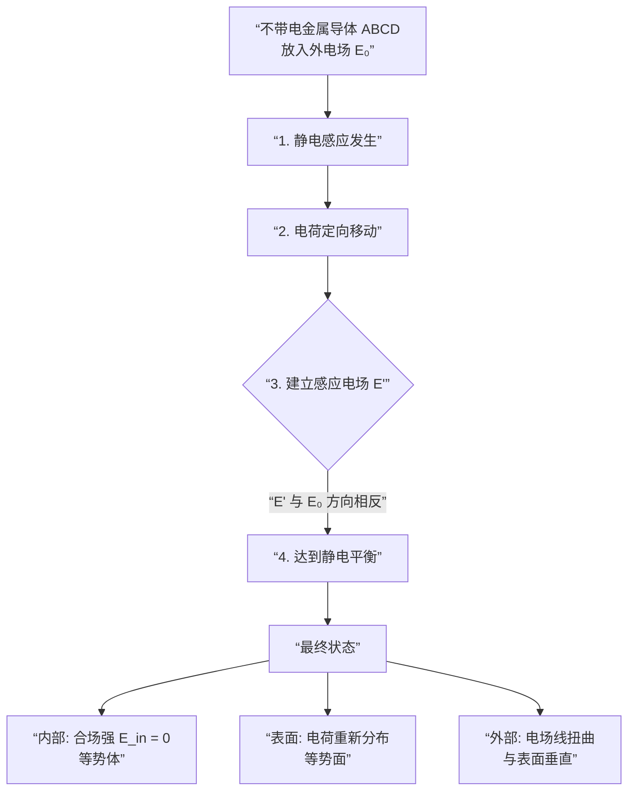

# 1

物理实验, 带正电的带电体, 带负电的带电体. 如何实现的. 那个带电体是一个小球, 为何带电.

---

好的，这是一个非常经典的物理实验问题。我们来详细拆解一下如何实现，以及小球为何会带电。

### 第一部分：如何实现小球带电

在物理实验中，让一个孤立的小球（通常是金属材质，如铜或铝）带电，主要有两种基本方法：**接触起电**和**感应起电**。

#### 方法一：接触起电

这种方法是通过让小球直接与一个已经带电的物体接触，从而转移电荷。

**1. 让小球带正电：**

- **步骤：**
  1.  用一个已经**带正电**的物体（例如，用丝绸摩擦过的玻璃棒）。
  2.  让这个带正电的玻璃棒**接触**中性（不带电）的金属小球。
  3.  由于玻璃棒缺少电子（带正电），而小球是中性，接触时小球上的一部分电子会被玻璃棒吸引过去。
  4.  当把玻璃棒移开后，小球因为失去了一些电子，整体上就带**正电**了。

**2. 让小球带负电：**

- **步骤：**
  1.  用一个已经**带负电**的物体（例如，用毛皮摩擦过的橡胶棒）。
  2.  让这个带负电的橡胶棒**接触**中性的金属小球。
  3.  由于橡胶棒多余电子（带负电），而小球是中性，接触时橡胶棒上的一部分电子会转移到小球上。
  4.  当把橡胶棒移开后，小球因为得到了一些多余的电子，整体上就带**负电**了。

**核心原理：** 电荷通过直接接触，从一个物体转移到另一个物体。

---

#### 方法二：感应起电

这种方法不直接接触带电体，而是利用静电感应的原理，并通过接地来永久性地使小球带电。这是更常用、更精密的实验方法。

**1. 让小球带负电：**

- **步骤：**
  1.  将一个**带正电**的物体（如玻璃棒）**靠近**但不接触中性的金属小球。
  2.  由于静电感应，小球内的自由电子会被正电荷吸引，聚集在靠近玻璃棒的一端。而远离玻璃棒的一端则因缺少电子而带正电。
  3.  在小球带正电的这一端**短暂接地**（例如用手指触碰一下）。大地作为巨大的电荷库，电子会从大地流向小球，中和掉这里的正电荷。
  4.  **先断开接地线**，**再移走带正电的物体**。
  5.  此时，之前被吸引过来的电子由于失去了正电荷的束缚，会均匀分布在整个小球上，因此小球整体带**负电**。

**2. 让小球带正电：**

- **步骤：**
  1.  将一个**带负电**的物体（如橡胶棒）**靠近**但不接触中性的金属小球。
  2.  由于静电感应，小球内的自由电子会被负电荷排斥，聚集在远离橡胶棒的一端。而靠近橡胶棒的一端则因缺少电子而带正电。
  3.  在小球带负电的这一端（即远离橡胶棒的一端）**短暂接地**。小球上多余的电子会通过接地线流向大地。
  4.  **先断开接地线**，**再移走带负电的物体**。
  5.  此时，小球上留下了正电荷，因此小球整体带**正电**。

**核心原理：** 利用带电体靠近引起的电荷重新分布，并通过接地将不需要的电荷导走，从而让目标物体带上与起电物体**相反**的电荷。

**记忆口诀：** 感应起电，**近异远同，接地导走相反的电荷**。

---

### 第二部分：小球为何带电？

这个问题的答案就是**电子的转移**。

根据原子模型：

- 原子由带正电的**原子核**和带负电的**电子**组成。
- 正常情况下，原子核的正电荷数与核外电子的负电荷数相等，所以物体整体呈电中性（不带电）。
- **带电的本质，就是物体失去或得到电子的过程。**

- **带正电：** 当小球**失去**一部分电子时，正电荷的数量就超过了负电荷，所以整体显示带正电。

  - 就像你的银行账户，花钱（失去电子）后，你的净资产（净电荷）就变正了（欠债？可以这么类比，但不太准确）。

- **带负电：** 当小球**得到**一部分多余的电子时，负电荷的数量就超过了正电荷，所以整体显示带负电。
  - 就像你的银行账户，存钱（得到电子）后，你的净资产（净电荷）就更多了（为正）。但在这里，我们关注的是“电荷”本身，得到负电荷（电子）就意味着带负电。

**总结一下：**

| 目标电荷 | 方法     | 关键操作                 | 微观解释                             |
| :------- | :------- | :----------------------- | :----------------------------------- |
| **正电** | 接触起电 | 用带正电物体接触小球     | 小球**失去**电子                     |
| **负电** | 接触起电 | 用带负电物体接触小球     | 小球**得到**电子                     |
| **负电** | 感应起电 | 用带正电物体靠近，并接地 | 电子从大地流向小球，小球**净得**电子 |
| **正电** | 感应起电 | 用带负电物体靠近，并接地 | 电子从小球流向大地，小球**净失**电子 |

在实验中，通常使用感应起电法，因为它可以精确地控制小球所带电荷的种类，并且避免了接触可能带来的电荷损失。你可以用验电器来验证小球是否带电以及所带电荷的种类。

# 2

库仑定律中, q 有正负号吗

---

这是一个非常关键的问题，答案是：

**在库仑定律的原始公式中，电荷 q 代入的是其绝对值，没有正负号。但在其矢量形式中，电荷是带正负号的。**

让我们来详细解释一下：

### 1. 库仑定律的标量形式（计算力的大小）

这是最常见的形式，用于计算两个点电荷之间静电力 **的大小**。

公式为：
**F = k _ |q₁ _ q₂| / r²**

- **F**： 静电力的大小（绝对值），永远为正。
- **k**： 库仑常数。
- **q₁, q₂**： 两个点电荷的电荷量。**在这个公式中，我们只代入它们的数值（绝对值）**。
- **r**： 两个电荷之间的距离。

**为什么只用绝对值？**
因为力的大小（F）永远是一个正数。这个公式只关心力有多大，而不关心方向。力的方向我们通过“同性相斥，异性相吸”的原则单独判断。

**举例：**

- 一个 +3 C 的电荷和一个 -5 C 的电荷，相距 1 m。
- 计算力的大小时，我们代入 `q₁ = 3`, `q₂ = 5`（取绝对值）。
- `F = k * (3 * 5) / 1²`
- 得到力的大小后，再根据它们电性相反，判断这是吸引力。

---

### 2. 库仑定律的矢量形式（同时给出力的大小和方向）

这是一种更严谨、更通用的形式，常用于大学物理和更复杂的矢量分析中。

公式为：
**F₁₂ = k _ (q₁ _ q₂ / r²) \* r̂₁₂**

- **F₁₂**： 电荷 1 作用于电荷 2 的 **力矢量**。
- **q₁, q₂**： **在这里，电荷是带正负号的代数量**（例如，电子电荷为 -e）。
- **r̂₁₂**： 从电荷 1 指向电荷 2 的 **单位矢量**。

**这个公式如何同时确定大小和方向？**

1.  **方向由乘积的符号决定：**

    - 计算 `(q₁ * q₂)`。如果结果是 **正数**（同种电荷），则 `F₁₂` 的方向与 `r̂₁₂` 相同。`r̂₁₂` 的方向是从电荷 1 指向电荷 2，这意味着电荷 2 受到一个 **远离** 电荷 1 的力，即 **斥力**。
    - 如果 `(q₁ * q₂)` 的结果是 **负数**（异种电荷），则 `F₁₂` 的方向与 `r̂₁₂` 相反。这意味着电荷 2 受到一个 **指向** 电荷 1 的力，即 **吸引力**。

2.  **大小由绝对值保证：**
    - 公式中的 `r²` 永远是正的，所以力的大小 `|F₁₂|` 实际上等于 `k * |q₁ * q₂| / r²`，这与标量形式一致。

**举例（使用矢量形式）：**

- `q₁ = +3 C`， `q₂ = -5 C`， 相距 1 m。
- `q₁ * q₂ = (+3) * (-5) = -15`（负数）。
- 所以，`F₁₂` 的方向与 `r̂₁₂`（从 q₁ 指向 q₂）**相反**。
- 这意味着电荷 2 (q₂) 受到一个指向电荷 1 (q₁) 的吸引力。
- 力的大小为 `k * | -15 | / 1² = k * 15 / 1`。

### 总结与建议

| 形式         | 电荷 q                 | 目的                               | 方向判断                             |
| :----------- | :--------------------- | :--------------------------------- | :----------------------------------- |
| **标量形式** | **只代入绝对值**       | 计算**力的大小**                   | 额外使用“同性相斥，异性相吸”规则判断 |
| **矢量形式** | **代入带符号的代数值** | 同时计算**力的矢量**（大小和方向） | 方向由公式计算结果自动确定           |

**给你的实用建议：**

- **在高中物理或解决简单问题时：**
  请使用 **标量形式** `F = k * |q₁ * q₂| / r²` 来计算力的大小。然后，**单独**在你的脑海中或图上，根据电荷的正负来判断这个力是吸引力还是斥力。这是最不容易出错的方法。

- **在大学物理或进行矢量计算时：**
  你会开始使用 **矢量形式**，此时必须代入电荷的正负号，因为公式本身包含了方向的全部信息。

所以，简单回答你的问题：**在基础应用中，q 不带正负号；在高级矢量应用中，q 带正负号。** 你现在需要掌握的是第一种方法。

# 3

解释 匀强电场的生成, 为什么平行金属板生成

---

好的，这是一个非常核心的电磁学概念。我们来详细解释一下为什么平行金属板可以产生匀强电场，以及其背后的物理原理。

### 核心结论

在**理想条件**下（金属板大小远大于板间距离，且不考虑边缘效应），带有等量异种电荷的一对平行金属板之间的电场是**匀强电场**。

所谓匀强电场，就是说在这个区域内的每一点：

1.  **电场强度（E）的大小相等**。
2.  **电场强度（E）的方向相同**（从正极板指向负极板）。

下面我们从两个层面来解释为什么会产生这种匀强电场。

---

### 1. 理论基础：单个带电金属板的电场

首先，我们需要理解一个关键概念：**一个无限大的、均匀带电的金属板，它所产生的电场是匀强的，并且方向垂直于板面。**

- **物理图像**：想象在板附近有一个点 P。点 P 的电场强度是所有电荷产生的电场的矢量和。
- **为什么是匀强的？**
  - 对于点 P 来说，它“看到”的电荷分布是对称的。你可以在点 P 的左边找到一个电荷元，在右边一定能找到一个对称的电荷元。
  - 虽然每个单独的电荷元产生的电场是向四面八方发散的（库仑定律），但这些对称电荷元的电场在**平行于板面方向**的分量会相互抵消。
  - 最终，所有电荷元的电场在**垂直于板面方向**的分量会**叠加**起来，形成一个方向始终垂直于板面、大小处处相等的电场。

**重要推论**：单个无限大带电板的电场线是一系列密度均匀、方向垂直且彼此平行的直线。

---

### 2. 叠加原理：两个平行金属板的组合

现在，我们有两块平行的金属板，一块带正电（+Q），一块带负电（-Q）。

根据电场的**叠加原理**，空间任意一点的合场强 **E**，等于正极板在该点产生的场强 **E₊** 和负极板在该点产生的场强 **E₋** 的矢量和。

我们分三个区域来讨论：

**a) 正极板左侧区域**

- **E₊**（正极板产生）：方向**向右**（电场线从正电荷出发）。
- **E₋**（负极板产生）：方向**向右**（电场线指向负电荷）。
- **合场强 E = E₊ + E₋**，方向向右，且大小是两个场强之和。

**b) 两极板之间区域**

- **E₊**（正极板产生）：方向**向右**。
- **E₋**（负极板产生）：方向也**向右**（因为负极板在右侧，电场线指向它自己，所以也是向右）。
- **合场强 E = E₊ + E₋**，方向向右，且大小是两个场强之和。**这是场强最强的区域。**

**c) 负极板右侧区域**

- **E₊**（正极板产生）：方向**向左**。
- **E₋**（负极板产生）：方向**向左**。
- **合场强 E = E₊ + E₋**，方向向左，且大小是两个场强之和。

#### 关键一步：为什么板外电场为零？

上面的分析似乎显示板外也有电场。但这只有在**板无限大**的理想情况下才成立。在现实中，我们如何让板外电场近似为零呢？

答案是：**通过连接电源**。

当我们用导线将两块平行金属板连接到一个电源（如电池）的两极时，会发生以下情况：

1.  电源将电子从正极板“泵”到负极板。
2.  正极板因缺少电子而带正电（+Q），负极板因多余电子而带负电（-Q）。
3.  这些电荷会**完全分布在两块金属板相对的内表面上**。因为异种电荷相互吸引，它们都被牢牢地“拉”到了彼此最近的位置。
4.  由于所有电荷都集中在相对的内表面上，根据叠加原理，在**金属板外部区域**：
    - 正极板左侧的电场 **E₊** 和负极板左侧的电场 **E₋** 大小相等、方向**相反**，**完全抵消**。
    - 同理，在负极板右侧，两个电场也相互抵消。
5.  因此，**合电场几乎完全被“束缚”在了两块平行板之间的区域**。

---

### 最终图像：板间的匀强电场

现在，我们只看两极板之间的区域：

- 正极板内表面的正电荷产生一个垂直指向负极板的匀强电场 **E₊**。
- 负极板内表面的负电荷也产生一个垂直指向它自己（即从正极板指向负极板）的匀强电场 **E₋**。
- 这两个场强的**方向完全相同**。
- 所以，合场强 **E = E₊ + E₋**，其大小为 **E = σ / ε₀**（其中 σ 是电荷面密度，ε₀ 是真空介电常数）。这是一个大小和方向都恒定的电场——**匀强电场**。

### 总结

平行金属板产生匀强电场的根本原因在于：

1.  **单个带电板的贡献**：无限大带电板产生垂直于板面的匀强电场。
2.  **电荷的分布**：连接电源后，电荷只分布在相对的内表面，这使得板外电场相互抵消，板内电场叠加增强。
3.  **叠加原理**：在两板之间，两个板产生的匀强电场**方向一致**，矢量叠加后依然是一个更强的、方向不变的匀强电场。

在实际实验中，只要确保金属板足够大、板间距离足够小，就可以近似地认为它们之间的电场是匀强的，这是许多实验（如测定电子比荷、示波器等）的基础。

# 4

库仑力的作用点是什么

---

这是一个非常好的问题，它触及了力学和电磁学中一个重要的概念。答案需要分情况讨论：

**核心答案：库仑力的作用点取决于带电体的模型。**

主要分为两种情况：

---

### 情况一：对于“点电荷”

**作用点就在点电荷本身所在的位置。**

- **什么是点电荷？** 这是一个理想化的物理模型，当带电体的大小和形状与研究问题中的距离相比可以忽略不计时，我们就可以把它看作一个点电荷。它拥有电荷和质量，但没有体积。
- **为什么？** 因为点电荷没有尺寸，力自然作用在这个“点”上。在受力分析和计算加速度时，我们直接将这个力画在代表点电荷的那个点上。

**例如：** 计算一个电子绕原子核运动时，我们将原子核和电子都视为点电荷，库仑力就作用在它们各自的中心。

---

### 情况二：对于“实际带电体”（非点电荷）

对于有大小、有形状的实际带电体（比如实验中的金属小球、带电棒等），情况更复杂一些。我们需要引入另一个概念——**质心**。

**库仑力合力的作用点，可以看作是带电体的质心。**

- **为什么？**
  1.  **力的分布：** 一个带电体受到的库仑力，其实是它身上**每一个带电部分**所受到的库仑力的总和。这些力的大小和方向可能各不相同。
  2.  **合力与作用点：** 在计算这个带电体的**平动**（即整体移动，而非转动）时，我们可以将所有这些小力等效为一个合力。理论力学可以证明，对于远程力（如引力、库仑力），这个合力的作用点就在物体的**质心**上。

**重要说明：**

- **“看作”不等于“就是”：** 严格来说，力是作用在电荷分布的整个物体上的。但为了简化问题，研究物体的整体运动时，我们可以“等效地”认为这个合力作用在质心上。
- **与“重心”的类比：** 这和重力的处理方式完全一样。重力作用在物体的每一个质点上，但我们在分析物体整体运动时，总是把重力的合力画在重心（与质心通常重合）上。库仑力的处理方式与此类似。

---

### 一个关键的区别：内力 vs. 外力

在理解库仑力的作用点时，区分“内力”和“外力”至关重要。

- **对于单个带电体：** 当我们说一个带电球“受到库仑力”时，我们是从这个球的**外部**来看的。这个力是**外力**，它的作用点（等效为质心）决定了球将如何加速平动。

  - **例如：** 一个带正电的金属小球被一个固定的带负电的球吸引。在分析小球的运动轨迹时，我们就把吸引力画在小球的质心上。

- **对于系统内部：** 如果我们把两个相互吸引或排斥的带电体看作一个**整体系统**，那么它们之间的库仑力就成了**内力**。根据牛顿第三定律，这些内力总是成对出现、大小相等、方向相反的。
  - **重要：** 内力**不会改变**整个系统质心的运动状态。它只能改变系统内各个部分之间的相对运动。
  - **例如：** 电子和原子核通过库仑力组成氢原子。这两个粒子间的库仑力是系统的内力，它不会让整个原子的质心移动，但能使电子绕核旋转。

### 总结

| 情况           | 作用点                 | 解释与说明                                                                                           |
| :------------- | :--------------------- | :--------------------------------------------------------------------------------------------------- |
| **点电荷**     | 点电荷本身的位置       | 因为模型本身没有尺寸。                                                                               |
| **实际带电体** | **质心**（等效作用点） | 为了分析物体**整体平动**，将所有分布力等效为一个作用在质心上的合力。                                 |
| **系统内力**   | 作用在两个不同的物体上 | 当分析整个系统时，这是一对作用力与反作用力，它们分别作用在两个带电体上，**不会改变系统质心的运动**。 |

**简单来说：在进行受力分析，研究一个带电体将如何移动时，请将库仑力画在它的质心上。**

# 5

力, 矢量, 有大小和方向, 有作用点吗, 或者说可以任意平移等价吗

---

这是一个非常深刻和重要的力学问题。简单而直接的答案是：

**力是滑动矢量，但不能任意平移。**

下面我们来详细解释这个看似矛盾的说法。

### 核心概念：力的三要素

一个力要完全确定，必须包含三个要素：

1.  **大小**
2.  **方向**
3.  **作用点**

这意味着，**改变力的作用点，就会改变力的作用效果**。因此，力不能像自由矢量（如速度、位移）那样在空间内任意平移而保持等价。

---

### 为什么力不能任意平移？—— 一个思想实验

想象一下你用手推一扇门：

- **场景 A：** 你用力推门的**边缘**（远离门轴的一端）。门很容易就打开了（转动效果明显）。
- **场景 B：** 你用**同样大小、同样方向**的力推门的**转轴处**。门根本不会转动。

这个例子清晰地表明：**力的作用点决定了它产生的转动效果（力矩）**。平移力的作用点，即使保持大小和方向不变，也会完全改变其对物体的转动效应。

---

### “滑动矢量”的概念

既然力不能任意平移，那为什么又说它是“滑动矢量”呢？

**滑动矢量** 的定义是：**可以在其作用线上任意滑动的矢量**。

- **作用线：** 力所在的那条直线。
- **滑动：** 沿着这条直线移动力的作用点。

**关键点：沿着作用线滑动，不会改变力的任何作用效果。**

**为什么？**
根据静力学原理，一个力沿着其作用线移动时：

- 它产生的**平动效应**（即让物体整体移动的趋势）不变。
- 它对于空间任意一点的**力矩**也不变（因为力臂不变）。

**回到推门的例子：**
如果你在门边缘的 A 点推，和在门边缘同一作用线上的 B 点推，只要这两个点在同一条平行于你推力方向的直线上，那么开门的效果是**完全相同**的。这就是“滑动”的含义。

---

### 总结与对比

为了更清晰地理解，我们可以将物理中的矢量分为三类：

| 矢量类型     | 描述                                     | 例子                                                   | 能否任意平移？                 |
| :----------- | :--------------------------------------- | :----------------------------------------------------- | :----------------------------- |
| **自由矢量** | 只需大小和方向，与位置无关。             | **位移、速度、角速度**                                 | **可以**                       |
| **滑动矢量** | 需大小、方向和作用线，可在作用线上滑动。 | **力、动量**                                           | **不能**（但可在作用线上滑动） |
| **固定矢量** | 需大小、方向和确定的作用点。             | **作用在弹性体上的力**、**场矢量**（如某点的电场强度） | **不能**                       |

**对“力”的最终结论：**

1.  **力有确定的作用点**：在完整描述一个力时，必须指明其作用点。
2.  **力是滑动矢量**：在分析其对刚体的外效应（平动和转动）时，我们可以将其**作用点沿着其作用线任意滑动**，而不改变其物理效应。
3.  **力不能任意平移**：将其作用点**移动到另一条平行的作用线上**（即平移），会改变其力矩，从而改变其转动效应，因此**不是等价的**。

**特别提醒：** 当研究力的**内效应**（如物体的变形）时，力就被视为**固定矢量**，连滑动都不允许，因为作用点不同会导致完全不同的应力分布和变形模式。但在大多数经典力学问题中，我们研究的是刚体或物体的整体运动，因此将力视为滑动矢量是标准做法。

# 6

解释 不带电的金属导体 abcd, 放到电场强度 e0 电场中, 由于静电感应...

---

好的，我们来详细解释一下这个经典的静电感应过程。

当一个不带电的金属导体 ABCD 放入一个均匀的外电场 \( \vec{E_0} \) 中时，会发生一系列变化，最终达到静电平衡状态。整个过程如下图所示，我们可以结合图示来分步理解：

### 最终状态的详细总结

经过上述过程，导体最终达到静电平衡，并呈现出以下关键性质：

1.  **导体内部场强为零**：

    - 这是静电平衡最核心的特征。导体内部的自由电子不再发生宏观定向移动，说明其内部的合电场强度处处为零：
      \( \vec{E\_{内部}} = \vec{E_0} + \vec{E'} = 0 \)

2.  **电荷只分布在导体表面**：

    - 所有感应出的正电荷和负电荷都分布在导体的外表面。在如图所示的均匀外电场中，电荷会集中在两个端面（AB 面和 CD 面）上。
    - **导体内部无净电荷**。电荷在表面分布的密度，取决于导体的几何形状。

3.  **整个导体是等势体，表面是等势面**：

    - 由于内部场强为零，在导体内部移动电荷，电场力不做功，因此内部各点电势相等。
    - 由于电场线垂直于导体表面，沿导体表面移动电荷，电场力也不做功，因此整个导体（包括内部和表面）是一个等势体。

4.  **外部电场的分布被改变**：
    - 导体内部的电场被屏蔽掉了。
    - 导体外部的电场线不再是均匀的平行线，而是会发生扭曲，并且**在导体表面附近，电场线始终垂直于导体表面**。

### 总结

简单来说，将不带电的金属导体放入外电场中，其内部自由电荷会因静电感应而重新分布，产生一个与外加电场方向相反的感应电场。当两者在导体内部完全抵消时，达到平衡。最终结果是：**导体内部场强为零，电荷分布在表面，整个导体成为一个等势体**。这就是“静电屏蔽”现象的原理——一个空腔导体可以屏蔽外部电场对其内部空间的影响。
