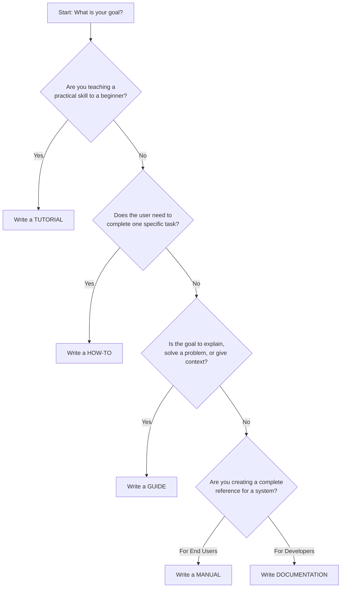

# a

compare guide and tutorial

---

Of course. This is an excellent question, as the terms are often used interchangeably, but they have distinct meanings and purposes.

Here’s a detailed comparison between a **guide** and a **tutorial**.

### At a Glance: The Core Difference

- **Tutorial:** A **structured, linear lesson** designed to **teach a beginner** how to accomplish a specific task or foundational concept. It's about learning by doing.
- **Guide:** A **comprehensive reference** designed to **inform and explain** a topic, system, or process. It can be used for learning, problem-solving, or deep understanding, often in a non-linear fashion.

---

### Detailed Comparison Table

| Feature              | Tutorial                                                                                                                     | Guide                                                                                                                                                       |
| :------------------- | :--------------------------------------------------------------------------------------------------------------------------- | :---------------------------------------------------------------------------------------------------------------------------------------------------------- |
| **Primary Goal**     | **Learning & Skill Acquisition.** To get a beginner to a specific, tangible outcome.                                         | **Understanding & Reference.** To provide information, context, and solutions.                                                                              |
| **Audience**         | **Beginners** or those new to a specific tool/feature.                                                                       | **All levels**, from beginners looking for overviews to experts seeking specific details.                                                                   |
| **Structure**        | **Linear and Sequential.** Step 1, Step 2, Step 3... leading to a final result. Deviating breaks the process.                | **Modular and Non-Linear.** Composed of sections/chapters that can often be read independently.                                                             |
| **Scope**            | **Narrow and Focused.** Covers one specific task, project, or feature. (e.g., "Build a simple calculator app").              | **Broad and Comprehensive.** Covers a wide topic, system, or product. (e.g., "Python Programming Guide").                                                   |
| **Tone & Approach**  | **Instructional and Directive.** Uses active, commanding language ("Click here," "Type this code," "Now you should see..."). | **Explanatory and Informative.** Explains the "why" behind the "what." More descriptive and conceptual.                                                     |
| **Outcome for User** | A completed task and a new, practical skill. The user has _done_ something.                                                  | Deepened knowledge and the ability to solve problems independently. The user _understands_ something.                                                       |
| **Best Used When**   | You are starting from zero and need to achieve a clear, immediate result.                                                    | You need to solve a specific problem, learn a concept, or explore a topic at your own pace.                                                                 |
| **Analogy**          | **A Cooking Recipe:** Follow these exact steps in order to bake a specific cake.                                             | **A Cookbook:** Contains recipes (like tutorials), but also techniques, ingredient explanations, and variations, allowing you to browse and learn concepts. |

---

### Examples to Clarify

Let's use the context of **learning to use a camera.**

- **Tutorial:**

  - **Title:** "How to Take a Sharp Photo of the Moon"
  - **Content:** A step-by-step process:
    1.  Set your camera to Manual mode.
    2.  Set your ISO to 100.
    3.  Set your aperture to f/11.
    4.  Set your shutter speed to 1/125.
    5.  Use a tripod and a timer.
    6.  Take the photo and review.

- **Guide:**
  - **Title:** "The Ultimate Guide to Camera Exposure"
  - **Content:** Comprehensive chapters explaining:
    - What the "Exposure Triangle" is (Aperture, Shutter Speed, ISO).
    - How each element affects the photo (depth of field, motion blur, noise).
    - How they interact with each other.
    - Different camera modes (Aperture Priority, Shutter Priority, Manual).
    - It provides the foundational knowledge to tackle _any_ shooting scenario, not just one.

### How to Choose: Tutorial vs. Guide

- **You need a TUTORIAL if:**

  - You are a complete beginner and feel lost.
  - You have a specific task you need to complete _right now_.
  - You learn best by following along and doing.
  - Your goal is a tangible, finished product.

- **You need a GUIDE if:**
  - You have some basic knowledge and want to deepen your understanding.
  - You need to solve a problem or look up a specific piece of information.
  - You want to understand the underlying concepts and principles.
  - You are evaluating a technology or product and need a broad overview.

### The Overlap

It's important to note that the lines are often blurred. A comprehensive **guide** might contain **tutorials** within it. For example, a "User Guide for Photoshop" will have conceptual explanations of layers and filters (guide content) and also include step-by-step walkthroughs for creating a specific effect (tutorial content).

In summary: **A tutorial teaches you _how_ to do one thing. A guide helps you understand _why_ and _when_ to do many things.**

# b

compare guide, tutorial, and others

---

Of course. This is an excellent question, as these terms are often used interchangeably but have distinct meanings and purposes.

Here’s a detailed comparison of "guide," "tutorial," and other related formats.

### At a Glance: Quick Comparison

| Feature          | Tutorial                                                             | Guide                                                                              | How-To                                 | Manual                                               | Documentation                                           |
| :--------------- | :------------------------------------------------------------------- | :--------------------------------------------------------------------------------- | :------------------------------------- | :--------------------------------------------------- | :------------------------------------------------------ |
| **Primary Goal** | **Learn by doing** to achieve a specific, beginner-friendly outcome. | **Understand a topic** or solve a problem; can be exploratory.                     | **Execute a single, discrete task.**   | **Comprehensive reference** for a system or product. | **Technical specification** and reference for a system. |
| **Scope**        | Narrow, focused on one project or goal.                              | Broad or narrow, can be conceptual or practical.                                   | Very narrow, single action.            | Extremely broad, covers the entire system.           | Extremely broad, organized by components.               |
| **Audience**     | Beginners / New Users.                                               | Any level, from beginner to expert.                                                | Anyone who needs to perform that task. | Users who need in-depth knowledge.                   | Developers, technicians, administrators.                |
| **Structure**    | Linear, step-by-step.                                                | Modular, often with a table of contents for navigation.                            | A short, sequential list of steps.     | Reference-style, often with chapters and an index.   | API references, code comments, technical specs.         |
| **Outcome**      | A completed project and a new skill.                                 | Knowledge, a solved problem, or a completed task.                                  | A successfully completed task.         | The ability to use a system effectively.             | The ability to integrate or work with a system.         |
| **Example**      | "Build Your First Website with HTML & CSS"                           | "A Beginner's Guide to Cryptocurrency" or "Troubleshooting Guide for Wi-Fi Issues" | "How to Screenshot on a Mac"           | "User Manual for Nikon Z9 Camera"                    | "Python 3.11 Documentation"                             |

---

### Deep Dive into Each Format

#### 1. Tutorial

A tutorial is a hands-on, instructional session designed to teach a practical skill by having the learner _do_ something.

- **Purpose:** Education through implementation. The focus is on the learning process itself.
- **Approach:** "Follow me." It's highly prescriptive and linear. You start at point A and follow the steps until you reach point Z, having created something along the way.
- **Prerequisites:** Often lists what you need to know or have before starting.
- **Best For:** Absolute beginners who need a guided introduction to a tool, language, or process.
- **Example:** A YouTube video titled "Photoshop Tutorial: How to Remove a Background in 5 Minutes" that walks you through the exact steps on a sample image.

#### 2. Guide

A guide is a broader resource that helps a user understand a topic, explore options, or solve a problem. It's less about rigid instruction and more about providing direction.

- **Purpose:** To inform, explain, and assist in decision-making or problem-solving.
- **Approach:** "Here's the landscape and your possible paths." It can be read non-linearly. The user is expected to jump to the sections relevant to them.
- **Structure:** Often includes comparisons, best practices, FAQs, and conceptual explanations alongside step-by-step instructions.
- **Best For:** Users who have a goal or a problem but need context, options, or troubleshooting help.
- **Example:** "The Ultimate Guide to Buying a Laptop" would explain CPUs, RAM, storage, help you determine your needs, and compare different models, rather than telling you "buy this exact one."

#### 3. How-To

A how-to is the simplest and most action-oriented format. It's a concise set of instructions for accomplishing a single, specific task.

- **Purpose:** Pure task-completion. The goal is the outcome, not necessarily the learning.
- **Approach:** "Do this, then this, then this." It's a recipe. No fluff, no theory.
- **Scope:** Very narrow. It assumes you already have the context and just need the steps.
- **Best For:** Quick answers for a discrete task you already understand conceptually.
- **Example:** "How to Reset Your Wi-Fi Router" or "How to Boil an Egg." The user isn't trying to become a network engineer or a chef; they just need to get one thing done.

---

### Other Related Formats

#### Manual

A manual is a comprehensive, authoritative reference document for a product or system. It describes all features, functions, and specifications in detail.

- **Purpose:** To be a complete source of truth. It's for looking up information, not reading cover-to-cover.
- **Approach:** Descriptive and exhaustive. "This is what this button does. These are the system parameters."
- **Best For:** Users who need to understand the full capabilities of a complex product (e.g., a camera, a software application, a car).

#### Documentation

This is the technical counterpart to a user manual, primarily written for developers, sysadmins, or engineers.

- **Purpose:** To specify how a system works, how to integrate with it, and its API (Application Programming Interface).
- **Approach:** Highly technical, structured, and factual. It consists of code comments, API endpoints, class descriptions, and architectural diagrams.
- **Best For:** Developers using a library, framework, or API.

### How to Choose the Right Format

Use this simple decision flowchart:

**In summary:**

- Use a **Tutorial** to teach.
- Use a **Guide** to explain or direct.
- Use a **How-To** to enable a single action.
- Use a **Manual** or **Documentation** to provide a complete technical reference.
