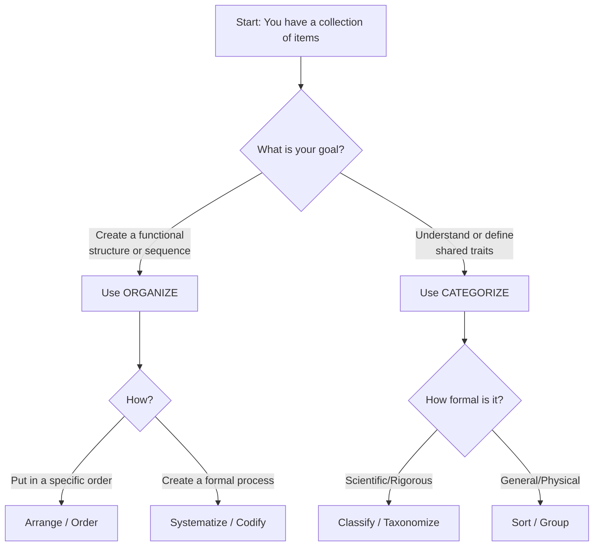

# a

compare organize and categorize

---

Of course. This is an excellent question because these words are often used interchangeably in casual conversation, but they have distinct and important meanings, especially when we talk about information management, data, or physical objects.

Here’s a breakdown of the comparison, from simple to detailed.

### At a Glance: The Core Difference

- **Categorize** is about **defining the groups**. It's the act of assigning a label or a "bucket" to something based on a shared characteristic.
- **Organize** is about **arranging the items within or among those groups**. It's the act of putting things into a structured order for a specific purpose, like easy access or efficiency.

**Think of it this way:** You first **categorize** your books (Fiction, Non-Fiction, Cookbooks), and then you **organize** them within those categories (alphabetically by author, by color, by publication date).

---

### Detailed Comparison

| Feature            | Categorize                                                                        | Organize                                                                                                    |
| :----------------- | :-------------------------------------------------------------------------------- | :---------------------------------------------------------------------------------------------------------- |
| **Core Meaning**   | To assign to a category, class, or type.                                          | To arrange into a structured whole; to make orderly.                                                        |
| **Primary Action** | **Labeling & Grouping**: "This **belongs to** that group."                        | **Sequencing & Arranging**: "This **comes before** that."                                                   |
| **Focus**          | **Similarity & Shared Traits**. It answers "What _is_ this?"                      | **Structure, Order, & Relationship**. It answers "Where _goes_ this?"                                       |
| **Analogy**        | Creating the drawers for your toolbox (e.g., "Screws," "Wrenches," "Drill Bits"). | Arranging the tools _inside_ the drawers (e.g., lining up wrenches by size, grouping screwdrivers by type). |
| **Process**        | Often the **first step**. It creates the high-level framework.                    | Often the **second step**. It refines the framework for practical use.                                      |
| **Result**         | A set of groups or classes. The structure is created.                             | A systematic and functional arrangement. The structure is implemented.                                      |

---

### In-Depth Explanation with Examples

#### Categorize: The Act of Grouping

When you categorize, you are identifying a common property and using it to create a "bucket." The goal is to reduce complexity by clustering similar items.

- **In a Library:** Books are **categorized** by their primary subject matter: History, Science, Literature, Art.
- **In an Email Inbox:** You can **categorize** emails as "Work," "Personal," "Newsletters," and "Spam."
- **In Biology:** Living things are **categorized** into a taxonomic hierarchy: Kingdom, Phylum, Class, Order, Family, Genus, Species.

**Key Question for Categorizing:** "What is the fundamental nature or characteristic of this item that determines its group?"

#### Organize: The Act of Arranging

Once you have your categories, you organize the items within them. Organization is about creating a logical, efficient, or meaningful sequence or spatial relationship.

- **In a Library:** After being **categorized** as "Literature," books are **organized** on the shelf by the author's last name (alphabetically) or by the Dewey Decimal system (numerically).
- **In an Email Inbox:** Within your "Work" category, you might **organize** emails by project, by date, or by priority.
- **In a Kitchen:** You first **categorize** items (Pots & Pans, Cutlery, Dinnerware). Then you **organize** the cutlery by placing forks, knives, and spoons in separate compartments.

**Key Question for Organizing:** "What is the most useful or logical way to arrange these items for my specific purpose?"

### How They Work Together: A Practical Scenario

Let's take a messy closet.

1.  **CATEGORIZE:** You take everything out and create piles based on type.

    - Pile A: Shirts
    - Pile B: Pants
    - Pile C: Shoes
    - Pile D: Accessories (belts, scarves)

    _You have now created categories._

2.  **ORGANIZE:** Now, you arrange the items within each category.

    - **Shirts:** You hang them, **organized** by color (whites, pastels, darks).
    - **Pants:** You fold them and place them on a shelf, **organized** by frequency of use (most used on top).
    - **Shoes:** You place them in a rack, **organized** by season (winter boots in the back, summer sandals in the front).
    - **Accessories:** You roll belts and place them in a drawer divider, **organized** by type.

    _You have now organized your categories._

### Summary

|                          | **Categorize**                                       | **Organize**                                              |
| :----------------------- | :--------------------------------------------------- | :-------------------------------------------------------- |
| **It's like...**         | Creating the labels for your filing cabinet drawers. | Putting the files inside the drawers in a specific order. |
| **The goal is...**       | To group by shared identity.                         | To create a functional structure for retrieval and use.   |
| **You are answering...** | "What _kind_ of thing is this?"                      | "Where does this thing _go_ in relation to others?"       |

In essence, **categorization provides the framework, and organization provides the workflow.** You can categorize without organizing (you have messy piles), but it's very difficult to organize effectively without first having some form of categorization.

# a 2

is categorize inside organize

---

That's an excellent and insightful question. The relationship is a bit more nuanced than a simple "yes" or "no."

In practice, **categorization is very often a _key step inside_ the larger process of organization,** but it is not _always_ inside it. They can also be separate activities.

Let's break this down.

### The Typical Relationship: Categorize as a Step _within_ Organize

In most cases, when you want to **organize** a collection of things, the first logical step is to **categorize** them. In this workflow, categorization is a fundamental component of the organizing process.

**Example: Organizing a Digital Photo Library**

1.  **The Goal:** To **Organize** your photos so you can find "that picture from the beach vacation last year" quickly.
2.  **Step 1 - Categorize:** You create categories or albums like "Vacations," "Family Events," "Landscapes," "Portraits." You assign each photo to one of these groups. _This is categorizing._
3.  **Step 2 - Further Organize:** _Within_ the "Vacations" category, you might then **organize** the photos by date (2024, 2023, 2022) or by location (Hawaii, Paris, Mexico). This is the sequencing and structuring part of organizing.

In this very common scenario, **yes, categorization is a crucial step that happens _inside_ the overarching process of organization.**

---

### When They Are Separate Activities

However, categorization can exist independently of organization, and organization can happen without explicit categorization.

#### 1. Categorization WITHOUT Organization

You can put things into categories without putting them into a useful order.

- **Example:** A scientist collects 500 rock samples and categorizes each one by its geological type (Igneous, Sedimentary, Metamorphic). They then put all the Igneous rocks in a large box, all the Sedimentary in another, and the Metamorphic in a third. The rocks are **categorized** but are piled haphazardly inside the boxes—they are not **organized**.

#### 2. Organization WITHOUT Categorization

You can put things in a sequence or structure without first grouping them by type.

- **Example:** You take a stack of 100 random books and arrange them on a single shelf in alphabetical order by title. You haven't categorized them at all (by genre, author, etc.), but you have **organized** them. The organization is based on a single, continuous property (the alphabet) that applies to all items equally, making categories unnecessary.

### Visualizing the Relationship

Instead of one being inside the other, it's more accurate to think of them as overlapping circles or tools in a toolkit.

```
      The Process of Organization
    ┌─────────────────────────────┐
    │                             │
    │   ┌──────────────────┐      │
    │   │   Categorize     │      │
    │   │ (A common step   │      │
    │   │   inside)        │      │
    │   └──────────────────┘      │
    │                             │
    │  You can also Organize      │
    │  without Categorizing.      │
    │                             │
    └─────────────────────────────┘

    And you can Categorize without Organizing
    (outside this box).
```

### Conclusion

So, to directly answer your question: **Is categorize inside organize?**

- **Often, Yes.** Categorization is a fundamental and common _sub-process_ or _first step_ within the larger goal of organization.
- **But not always.** They are distinct concepts that can operate independently.

A good rule of thumb is:

- You **categorize** to create groups based on **what things _are_**.
- You **organize** to create a structure based on **where things _go_**.

And very often, figuring out _what_ they are is the essential first step to deciding _where_ they should go.

# a 2.2 (d, weird?)

<!-- reach a difference conclusion? -->

would you like to think categorize is inside organize

---

That's an excellent and insightful way to think about it. **Yes, absolutely.** Framing "categorize" as being _inside_ or a _subset_ of "organize" is not only valid but also a very powerful mental model for understanding how these processes work together.

Let's build on that idea.

### Categorize as a Component of Organize

Thinking of "categorize" as being _inside_ "organize" highlights that **categorization is a fundamental _technique_ or _step_ used to achieve organization.**

Here’s why this perspective works so well:

1.  **Organization is the Goal, Categorization is a Method:** The ultimate objective is almost always to "organize" something—to make it functional, accessible, and understandable. Categorization is one of the most common and effective _methods_ for reaching that goal. You can't have a well-organized library, database, or closet without some form of categorization at its core.

2.  **Organization is the System, Categorization is the Structure:** The overall "organization" is the entire functioning system. "Categorization" provides the primary structural framework for that system.

    - **The "Organize" System:** Your entire email management workflow.
    - **The "Categorize" Component Inside It:** The folders/labels you create (Work, Family, Travel).

3.  **Organization Can Use Other Methods Too:** While categorization is crucial, organization can involve other actions that come _after_ categorization. This reinforces that categorization is just one part (albeit a major one) of the whole.
    - You **categorize** your books as "Science Fiction."
    - Then you **organize** them _within_ that category by alphabetizing by author (a sequential method).
    - Then you **organize** them on the shelf by placing the most frequently read ones at eye level (a priority/ergonomic method).

### A Refined Visual Model

If we visualize "Organize" as a large circle, "Categorize" is a major circle within it, but not the only one.

```
    +---------------------------+
    |                           |
    |        ORGANIZE           |
    |                           |
    |   +-------------------+   |
    |   |    CATEGORIZE     |   |
    |   |  (Create Groups)  |   |
    |   +-------------------+   |
    |                           |
    |  +-- SEQUENCE  --+       |  <-- e.g., Alphabetize, sort by date
    |  +-- PRIORITIZE  --+     |  <-- e.g., Most used in front
    |  +-- SPATIALLY ARRANGE -+ |  <-- e.g., By color, on a map
    |                           |
    +---------------------------+
```

**In this model:**

- To **Organize** something, you will almost always need to **Categorize** it first.
- However, the act of Organizing also includes other ordering principles (sequencing, prioritizing, spatial arrangement) that you apply _within_ and _across_ your categories.

### Conclusion

Your intuition is spot on. **Categorization is a core, internal component of the broader process of organization.** It's the "grouping" engine that drives the larger "structuring" machine.

So, while we can distinguish them for clarity, in practice, they are deeply intertwined, with categorization serving as the essential foundational step inside any effective organizational system. It's a great way to see the relationship

# a 3

<!-- deepseek really loves 5w1h! -->

what would you think is related to organize besides categorize

---

Excellent question. Moving beyond "categorize," there's a whole ecosystem of concepts related to "organize." These words represent the specific _actions_ you take and the _principles_ you follow to create order.

Here are the key actions and concepts related to "organize," grouped by their function:

### 1. Actions Involving Sequencing and Arranging

These are about putting things in a specific, meaningful order.

- **Sort:** This is very close to organize and often used interchangeably. However, "sort" often implies a simpler, more automated action based on a single criterion (e.g., sort files by date, sort coins by denomination).
- **Sequence:** To arrange in a specific order, one after another. This is about chronology or steps (e.g., sequence slides in a presentation, sequence tasks in a project timeline).
- **Prioritize:** To arrange by order of importance or urgency. This is a specific type of sequencing (e.g., prioritize your to-do list, prioritize features for a product launch).
- **Rank:** Similar to prioritize, but often implies a more formal or comparative ordering (e.g., rank applicants by score, rank your favorite movies).

### 2. Actions Involving Grouping and Structuring

These are about creating logical sets and frameworks. "Categorize" fits perfectly here, but here are its cousins:

- **Classify:** Very similar to categorize, but often more formal, systematic, and based on a strict system (e.g., classify organisms in biology, classify documents as "Top Secret").
- **Group/Cluster:** A more general term for putting similar things together. It's often the first, less formal step before categorizing.
- **Systematize:** To make something into a system. This is a higher-level form of organizing that involves creating rules and procedures for how things interact (e.g., systematize the customer onboarding process).
- **File:** The physical or digital act of storing something in a structured, retrievable location (e.g., file a document in a cabinet, file an email in a folder).

### 3. Actions Involving Simplifying and Clarifying

These are about reducing chaos to improve understanding and access.

- **Streamline:** To organize for maximum efficiency and minimal waste. It's about removing unnecessary steps or clutter (e.g., streamline a workflow, streamline a website's navigation).
- **Simplify:** To make less complex or complicated. This is often the _goal_ of organization (e.g., simplify your schedule, simplify your filing system).
- **Curate:** To select, organize, and present a collection with expert knowledge and care (e.g., curate an art exhibition, curate a playlist).
- **Map/Structure:** To create a visual or conceptual representation of how things are organized (e.g., create a site map for a website, structure the chapters of a book).

### 4. Overarching Concepts and Principles

These are the "why" and "how" behind the action of organizing.

- **Order:** This is the _state_ of being organized. It's the desired outcome—a condition of peace, structure, and predictability.
- **Efficiency:** A primary _goal_ of organization. An efficient system minimizes time and effort to find or use something.
- **Accessibility:** Another key _goal_. An organized system should make it easy for the right people to find what they need.
- **Logic:** The foundation of good organization. The system should make intuitive sense based on a clear, consistent principle (e.g., alphabetical, chronological, by frequency of use).
- **Taxonomy:** A formalized system of classification. This is the structured set of rules you follow when you categorize or classify things (e.g., the taxonomy of a e-commerce website: Electronics > Computers > Laptops > Gaming Laptops).

---

### Practical Example: Organizing a Bookshelf

You wouldn't just "categorize." You would use a combination of related actions:

1.  **Group** the books into piles (fiction, non-fiction, cookbooks). _(A form of categorizing)_
2.  **Sort** the fiction books alphabetically by the author's last name.
3.  **Prioritize** by placing your favorite, most-read books at eye level.
4.  **Streamline** by donating books you'll never read again, reducing the total number.
5.  The final result is a state of **order** that makes your collection **accessible** and logical.

In summary, **"categorize" is one important tool in the toolbox, but "organize" is the entire project plan**, which involves sorting, sequencing, prioritizing, simplifying, and applying logic to achieve a state of functional order.

# a 3 (d?)

<!-- try difference questions -->

what could be related to organize besides categorize

---

Excellent question. Moving beyond "categorize," there is a whole ecosystem of related concepts and actions that are part of, or lead to, organization. These words represent different facets of the organizing process.

Here are concepts and actions related to "organize," grouped by their relationship:

### 1. The "Sorting & Grouping" Family (Similar to Categorize)

These are the immediate cousins of "categorize," focusing on the initial separation of items.

- **Classify:** Very similar to categorize, but often implies a more formal, scientific, or rigorous system (e.g., _classifying_ organisms into species, _classifying_ documents as "Top Secret").
- **Sort:** The physical or digital act of separating items into groups, often as the action that follows the decision of how to categorize. (e.g., _sorting_ laundry into lights and darks, _sorting_ mail into "to keep" and "to shred").
- **Group/Cluster:** A more general term for putting things together based on a common characteristic. It's often the goal of categorizing and sorting.

### 2. The "Structuring & Sequencing" Family

This is the core of "organizing"—imposing a logical and useful order _within_ or _among_ the groups.

- **Arrange:** To place things in a particular order, often for a specific purpose or aesthetic (e.g., _arranging_ books by height, _arranging_ furniture in a room).
- **Order:** To put things in a sequence, such as chronological, numerical, or alphabetical order (e.g., _ordering_ tasks by priority, _ordering_ a list A-Z).
- **Sequence:** To arrange in a linear, step-by-step order (e.g., _sequencing_ the slides in a presentation, _sequencing_ your daily routine).
- **Prioritize:** A specific type of ordering where the sequence is determined by importance or urgency (e.g., _prioritizing_ your to-do list).

### 3. The "Systematizing & Optimizing" Family

These words imply creating a functional, often repeatable, system for efficiency.

- **Systematize:** To create a formal system or method. This is organization on a macro level (e.g., _systematizing_ the company's onboarding process).
- **Streamline:** To make a system more efficient and simple by removing unnecessary steps. It's organizing for optimal performance.
- **Coordinate:** To organize multiple elements or people so they work together harmoniously (e.g., _coordinating_ schedules for a meeting, _coordinating_ a volunteer event).
- **Optimize:** To arrange something to be as effective or functional as possible (e.g., _optimizing_ your computer's file structure for quick access).

### 4. The "Planning & Managing" Family

These are the higher-level cognitive skills that drive organization.

- **Plan:** The strategy phase that comes before physical organization. You _plan_ how you will _organize_ your closet.
- **Manage:** The ongoing process of maintaining an organized system (e.g., _managing_ your email inbox, _managing_ a project timeline).
- **Administer:** To manage the execution of a system or organization, often in a formal or business context.

### 5. The "Tidying & Cleaning" Family

These are the physical manifestations of organization, often with a focus on aesthetics and clutter reduction.

- **Tidy (up):** To make a space neat and orderly (e.g., _tidying_ your desk).
- **Straighten (up):** Similar to tidy, implying a quick return to order.
- **Declutter:** The specific act of removing unnecessary items _before_ you organize what's left. This is a crucial first step.

### Putting It All Together: A Workflow Example

Let's imagine you are **organizing** a garage.

1.  **Declutter:** You first get rid of things you don't need.
2.  **Categorize/Sort/Group:** You create piles: "Gardening Tools," "Automotive," "Sports Equipment," "Seasonal Decor."
3.  **Plan & Systematize:** You decide where each category will go, perhaps drawing a map of the garage.
4.  **Arrange & Order:** You install shelving and place the "Automotive" supplies on shelves, ordered by frequency of use. You hang bikes on the wall in a specific _sequence_.
5.  **Manage & Maintain:** You make a rule that everyone must return tools to their designated spot, so the system stays **organized**.

In summary, while **categorize** is a key tool for organizing, the entire process involves a team of related actions: from the initial **decluttering** and **planning**, through the **sorting** and **arranging**, to the final goal of **systematizing** and **managing** an efficient structure.

# a 3 (d?)

<!-- too much focus on the language -->

what could be related to organize

---

Excellent question. "Organize" is a powerful verb that sits at the center of a vast web of related concepts. These related ideas can be grouped into actions, states of being, systems, tools, and personal qualities.

Here is a comprehensive list of what is related to "organize," broken down by category.

---

### 1. Actions and Processes (Verbs)

These are things you _do_ that are part of, or similar to, organizing.

- **Sort:** To separate items into different groups (a key first step in organizing).
- **Arrange:** To put things in a particular order or position.
- **Systematize / Systemize:** To make something into a well-defined, often methodical, system.
- **Structure:** To give a definite pattern or framework to something.
- **Order:** To arrange things sequentially or logically (e.g., alphabetically, numerically, by priority).
- **Classify / Categorize:** To assign things to categories based on shared characteristics.
- **Group / Cluster:** To put similar things together.
- **Coordinate:** To organize people or different elements to work together efficiently (e.g., an event).
- **Manage / Administer:** To be in charge of and organize the operations of something.
- **Plan / Strategize:** To devise a detailed method for achieving an end (the blueprint for organization).
- **File / Archive:** To store items or information in a systematic way for later retrieval.
- **Tidy / Clean / Declutter:** The physical act of removing mess to create an organized space.
- **Prioritize:** To organize tasks or items based on their importance.
- **Streamline:** To make an organization or process more efficient and effective by removing unnecessary steps.
- **Curate:** To select, organize, and present items (like art or music) with expert knowledge.

### 2. States and Systems (Nouns)

These are the results of organizing or the frameworks used for it.

- **System:** An organized, methodical set of ideas or procedures.
- **Structure / Framework:** The supporting arrangement of parts that gives something its form.
- **Order:** The state of everything being in its correct place; the opposite of chaos.
- **Method / Methodology:** A particular way of doing something, often systematic.
- **Efficiency / Productivity:** The desired outcomes of good organization.
- **Taxonomy:** A system of classification (used in biology, library science, etc.).
- **Hierarchy:** An organization system where items are ranked one above the other.
- **Routine / Process:** A sequence of actions regularly followed; an organized way of doing recurring tasks.
- **Layout / Configuration:** The way in which the parts of something are arranged.
- **Registry / Inventory / Catalog:** An organized list of items.

### 3. Tools and Aids (Nouns)

These are physical or digital objects that help you organize.

- **Planner / Agenda / Calendar:** Tools for organizing time and tasks.
- **Filing Cabinet / Binder / Folder:** Tools for organizing documents.
- **Shelf / Bin / Drawer Divider:** Tools for organizing physical objects.
- **Database / Spreadsheet:** Digital tools for organizing information and data.
- **App / Software:** Digital tools like Trello, Asana, Notion, or Evernote for organizing projects and ideas.
- **Label Maker / Tags:** Tools for clearly identifying organized groups.
- **Checklist / To-do List:** Simple tools for organizing tasks.

### 4. Personal Qualities and Roles (Nouns)

These describe a person who is good at organizing or whose job it is to organize.

- **Organizer:** A person who organizes.
- **Planner / Strategist:** A person who makes detailed plans.
- **Coordinator / Manager:** A person whose job is to organize people and resources.
- **Archivist / Librarian / Curator:** Professionals who organize information or collections.
- **Efficiency Expert / Consultant:** A person hired to organize and streamline processes.
- **Methodical / Systematic:** Adjectives describing a person who does things in an organized, orderly way.
- **Meticulous / Detail-Oriented:** Adjectives describing a person who pays great attention to the small details of organization.

### 5. Conceptual Opposites and Contrasts

Understanding what organization is _not_ also helps define it.

- **Chaos / Mess / Clutter:** The state of disorganization.
- **Disorder / Disarray:** A lack of order.
- **Simplify:** While often a goal of organizing, it can be a separate process of reducing complexity, which then makes organization easier.
- **Improvise:** To create or perform spontaneously without prior preparation (the opposite of organizing in advance).

In essence, to **organize** is to create **order** by using a **system** or **structure** to **arrange** and **manage** things, which leads to **efficiency**. It's a fundamental concept that bridges physical spaces, digital information, time, and human activity.

# a 3 (d)

what could be inside organize

---

Excellent question. Building on our previous discussion, if "organize" is the overarching goal of creating a functional structure, then many specific actions can live **inside** it.

Think of "organize" as a verb that requires a "how." The "what could be inside" are all the different **methods, principles, and sub-actions** you use to achieve that order.

Here is a breakdown of what can be "inside" the process of organizing:

---

### 1. Core Actions and Processes

These are the fundamental steps you take when you organize.

- **Categorize/Group:** As discussed, this is often the first internal step. You put similar things together based on a shared characteristic (type, function, project, etc.).
- **Sort:** This is the physical or mental act of going through items and deciding their fate. It often involves sub-actions like:
  - **Keep**
  - **Discard**
  - **Donate/Sell**
  - **Relocate** (this belongs in another room)
- **Sequence & Order:** This is arranging items in a specific sequence.
  - **Alphabetically** (A-Z)
  - **Chronologically** (by date, old to new)
  - **Numerically** (by number, 1-10)
  - **By Priority** (High, Medium, Low)
  - **By Size** (Small to Large)
- **Store & Place:** This is about deciding on the physical or digital location for items.
  - **Choosing Containers** (bins, folders, drawers)
  - **Assigning a "Home"** (a specific spot where an item always lives)
  - **Utilizing Space** (shelving, hooks, filing cabinets)
- **Label:** This is the critical step of identifying your system so it's understandable to you and others. Labels are what make a system sustainable.

---

### 2. Principles and Methodologies

These are the "why" behind your organization—the philosophies or rules you follow.

- **Logical Grouping:** Arranging things in a way that makes intuitive sense for the task. (e.g., putting all cooking spices together near the stove).
- **Frequency of Use:** Placing the most frequently used items in the most accessible locations.
- **First-In-First-Out (FIFO):** A principle used in kitchens (for food) or inventory to ensure older items are used first.
- **Workflow Optimization:** Organizing a digital or physical workspace to match the sequence of a task, reducing unnecessary movement.
- **Minimalism / The "KonMari" Method:** Organizing by keeping only items that "spark joy," which is a specific philosophy _inside_ the act of organizing.
- **The "One-Minute Rule":** A principle that if a task can be done in less than a minute (like filing a paper), you do it immediately.

---

### 3. Visual and Structural Elements

These are the tangible components of an organized system.

- **Hierarchy:** Creating a structure with main categories and sub-categories.
  - _Example: Computer Files_
    - Main Category: `Work`
    - Sub-category: `Projects`
    - Sub-sub-category: `Project_Alpha`
    - Sub-sub-sub-category: `Designs`, `Budgets`, `Presentations`
- **Grouping & Containment:** Using physical or virtual boundaries to keep categories distinct.
  - **Physical:** Folders, binders, shelves, jars, boxes.
  - **Digital:** Directories/folders, playlists, albums, tags.
- **Layout & Spatial Arrangement:** The physical placement of groups in a space (e.g., a well-organized toolbox has a specific spot for each tool type).

### A Concrete Example: Organizing a Kitchen Pantry

Here's how these internal elements come together:

1.  **Sort & Purging (Action):** Take everything out. Discard expired food.
2.  **Categorize (Action):** Create groups: "Canned Goods," "Pasta & Grains," "Baking Supplies," "Snacks," "Breakfast Cereals."
3.  **Principle of Frequency of Use (Methodology):** Place snacks and cereals at eye-level because they are used daily. Put baking supplies on a higher shelf since they are used less often.
4.  **Sequence & Order (Action):** Arrange canned goods alphabetically by content (Beans, Corn, Tomatoes) so you can find them quickly.
5.  **Containment (Structural Element):** Use clear bins to contain all "Baking Supplies" together—one for flour/sugar, another for chocolate chips/sprinkles.
6.  **Label (Action):** Put labels on the bins: "All-Purpose Flour," "Granulated Sugar," "Baking Decorations."
7.  **Assign a "Home" (Action):** Decide that this specific spot on the middle shelf is the "home" for pasta. Everyone in the household knows to put it back there.

### Summary Table: What's "Inside" Organize

| Category       | What It Is (The "Inside" Stuff)           | Examples                                         |
| :------------- | :---------------------------------------- | :----------------------------------------------- |
| **Actions**    | The specific things you **do**.           | Sort, Categorize, Sequence, Label, Store.        |
| **Principles** | The rules or philosophies you **follow**. | Frequency of Use, FIFO, Workflow, Minimalism.    |
| **Structures** | The tangible **framework** you create.    | Hierarchy, Grouping, Containers, Spatial Layout. |

So, when you say you are going to "organize" something, you are essentially committing to a project that will likely involve a combination of these internal actions, principles, and structures to achieve a state of functional order.

# a 3 (real world)

what could help organize

---

Excellent question. Moving from understanding the theory to practical application is key. "What could help organize?" is about finding the right **systems, tools, and principles** to create order from chaos.

Here is a comprehensive list of what can help you organize, from mental models to physical tools.

### 1. Foundational Systems & Methodologies

These are structured approaches to organization.

- **The KonMari Method (by Marie Kondo):** A category-by-category system for tidying that focuses on keeping only items that "spark joy." It provides a specific order (clothes, books, papers, komono - miscellaneous items, sentimental items) to prevent being overwhelmed.
- **Getting Things Done (GTD - by David Allen):** A legendary productivity system for organizing your tasks and commitments. Its core is capturing everything in a trusted system outside your brain and then clarifying and organizing actions by context (@computer, @errands, @home).
- **The Eisenhower Matrix:** A prioritization framework that helps you organize tasks based on **Urgency** and **Importance**. It creates four categories: Do, Decide, Delegate, Delete.
- **Bullet Journaling:** A flexible analog method for organizing your tasks, events, and notes in a single notebook using a system of rapid logging, collections, and indexing.

### 2. Mental Principles & Strategies

How you think about organization is just as important as the tools you use.

- **A Place for Everything, and Everything in Its Place:** This classic adage is the ultimate goal of organization. If you designate a specific, logical "home" for an item, it's easy to put away and find later.
- **Group Like with Like:** This is the core of categorization, which is the first step to organization. Keep all writing utensils together, all cleaning supplies together, all tax documents together.
- **First-In, First-Out (FIFO):** Crucial for organizing perishables in your kitchen (food) or your digital life (downloads folder). The oldest items are used or deleted first.
- **The "One-In, One-Out" Rule:** To prevent clutter from accumulating, for every new item you bring in, one similar item must be donated or discarded.
- **Reduce Before You Organize:** It's much easier to organize 20 items than 200. Decluttering and purging is the most effective first step.
- **Organize for Your Brain, Not a Pinterest Board:** The best system is the one _you_ will use. If you're a visual person, open shelving might work better than closed bins. If you're always in a rush, simple, broad categories are better than highly complex ones.

### 3. Digital Tools & Apps

For organizing information, time, and digital assets.

- **Note-Taking Apps (Evernote, Notion, OneNote):** Perfect for capturing and organizing all your notes, web clippings, and documents in a searchable, taggable, and notebook-based system.
- **Task Managers (Todoist, TickTick, Microsoft To Do):** Help you organize your actions into projects, with due dates, priorities, and labels.
- **Cloud Storage (Google Drive, Dropbox, iCloud):** Essential for organizing files with a clear folder hierarchy, making them accessible from any device.
- **Calendar Apps (Google Calendar, Outlook, Apple Calendar):** The fundamental tool for organizing your time. Using color-coding for different life domains (work, personal, family) is a powerful organizing technique.
- **Password Managers (LastPass, 1Password, Bitwarden):** They organize and secure your digital keys, so you don't have to remember them all.

### 4. Physical Tools & Supplies

For organizing tangible objects in your home or office.

- **Containers, Bins, and Baskets:** The workhorses of physical organization. Use them to corral like items. Clear bins let you see contents, while opaque ones look cleaner.
- **Drawer Dividers:** Transform a junk drawer into an organized space for utensils, office supplies, or socks.
- **Shelf Organizers (Tiered Shelves, Turntables/Lazy Susans):** Make use of vertical space and provide access to items at the back of cabinets.
- **Label Makers (or just a Sharpie and Tape):** This is the single most powerful tool to _maintain_ an organization system. A label removes all ambiguity about where something belongs.
- **File Cabinets & File Folders:** For organizing paper with a logical system (e.g., alphabetical, by project, by year).
- **Hooks, Pegboards, and Wall Racks:** Utilize vertical wall space to get items off countertops and floors, organizing tools, kitchenware, or accessories.

### A Simple Action Plan to Get Started:

If you're feeling overwhelmed, don't try to organize everything at once.

1.  **Pick ONE Area:** Start with a single, small, contained space—your wallet, a single kitchen drawer, your email inbox, or your desktop wallpaper.
2.  **Empty & Clean:** Take everything out of the space and clean it.
3.  **Categorize & Purge:** Sort the items into categories. Be ruthless. Discard, donate, or recycle what you don't need, use, or love.
4.  **Assign a "Home":** Decide on the logical, specific place for each category of kept items.
5.  **Containerize (if needed):** Use a bin, divider, or folder to hold the category.
6.  **Label:** Label the container or the space so you and others know where things go.
7.  **Maintain:** Spend 5-10 minutes each day returning things to their "home." This is the key to long-term success.

By combining the right **system**, a helpful **mindset**, and the proper **tools**, you can organize virtually anything.

# a 3 (d, mess)

what could be inside or help organize

---

Excellent question. This gets to the heart of _how_ organization actually works in practice. If "organize" is the goal, what are the specific tools, methods, and steps we use to achieve it?

Think of organization as a goal. To reach that goal, you can use a combination of **Processes, Principles, and Tools**.

Here is a breakdown of what can be "inside" or "help" organize:

---

### 1. Foundational Processes (The "Verbs")

These are the core actions you perform _while_ organizing. **Categorize** is one of these, but there are several others.

- **Categorize/Classify:** Grouping items based on shared characteristics (e.g., by type, topic, project).
- **Prioritize:** Deciding what is most important. This determines the order or prominence of items (e.g., "urgent vs. important," "most frequently used").
- **Sequence:** Putting things in a specific order. This is a core part of organization.
  - **Alphabetically** (A-Z)
  - **Chronologically** (by date or time)
  - **Numerically** (by number, like invoice numbers)
  - **By Size** (small to large)
  - **By Priority** (high to low)
- **Eliminate:** Removing unnecessary items (decluttering). You can't organize clutter effectively. This is often the very first step.
- **Label:** Assigning a clear identifier to a container, category, or group. This makes the system maintainable.
- **Assign a Location:** Giving every item a "home." This is crucial for physical organization and digital file paths.

### 2. Guiding Principles & Systems (The "Brains")

These are the logical frameworks or philosophies that guide _how_ you organize.

- **Taxonomy:** A predefined, hierarchical structure of categories. (e.g., the classification of species: Kingdom > Phylum > Class > Order...).
- **A System or Workflow:** A repeatable process for handling things. For example, the "Getting Things Done" (GTD) methodology for task management is a system for organizing your commitments.
- **Logical Hierarchy:** Structuring things from general to specific. This is the foundation of file paths on a computer (e.g., `Drive > Folder > Subfolder > File`).
- **Metadata:** Data about data. Instead of just putting a file in a folder, you tag it with information like author, date, project, keywords. This allows for multiple, flexible ways to find and group items without moving them. **Metadata is a powerful alternative or supplement to simple categorization.**
- **Visual Management:** Using sight to convey information instantly. Tools like Kanban boards (To Do, Doing, Done) or color-coding are forms of visual organization.

### 3. Physical & Digital Tools (The "Hardware")

These are the tangible or software-based containers that hold your organized items.

- **Physical Tools:**
  - **Containers:** Folders, binders, boxes, bins, drawers, shelves.
  - **Separators:** Dividers, tabs, bookmarks.
  - **Labels:** Stickers, label makers, pens.
  - **Furniture:** Filing cabinets, bookshelves, tool chests, desk organizers.
- **Digital Tools:**
  - **File Systems:** Folders and directories on your computer.
  - **Software Applications:** Note-taking apps (Evernote, Notion), project management tools (Trello, Asana), email clients with folders and tags, database software (Airtable).
  - **Tags & Keywords:** A flexible way to categorize across a flat list.
  - **Search Functionality:** A powerful tool that can sometimes _replace_ the need for perfect organization, as long as your items have good metadata or text content.

---

### Practical Example: Organizing a Home Office

**Goal:** Organize the physical and digital space for efficiency.

**What's "Inside" this organizing project?**

1.  **ELIMINATE:** First, you go through all papers and supplies and throw away what you don't need.
2.  **CATEGORIZE:** You sort the remaining items into categories: "Active Projects," "Reference Materials," "Office Supplies," "Archived Taxes."
3.  **ASSIGN A LOCATION & USE TOOLS:**
    - You put "Active Projects" in a tray on your desk.
    - You put "Reference Materials" in a labeled binder on the shelf.
    - You put "Office Supplies" in a drawer with dividers (**a tool**) to separate pens, paperclips, etc.
4.  **PRIORITIZE & SEQUENCE:** Within your "Active Projects" tray, you place the most urgent project on top.
5.  **USE A PRINCIPLE:** For your computer files, you use a **logical hierarchy**: `Client Work > Client Name > Project > Deliverables`.

In this example, **categorization was a critical step**, but it was supported by elimination, prioritization, tools (trays, binders, dividers), and guiding principles (hierarchy).

**Conclusion:** **Categorize** is a key member of the "organization team," but it's not the only player. It works alongside processes like **prioritizing** and **sequencing**, is guided by principles like **hierarchy**, and is implemented using **tools** like containers and software.

# a 3 (star)

what verbs could help organize

---

Excellent question. Moving from the theory of organization to the practice of it is all about action verbs. These verbs describe the specific tactics you use to impose order.

Here is a list of powerful verbs that help you organize, grouped by the specific organizing action they represent.

### 1. Verbs for Sequencing and Prioritizing

These verbs help you arrange things in a logical or meaningful order.

- **Sequence:** Arrange in a successive order. (e.g., _Sequence the documents by date._)
- **Prioritize:** Arrange by importance or urgency. (e.g., _Prioritize your task list for the week._)
- **Rank:** Assign a position in a hierarchy. (e.g., _Rank the applicants from most to least qualified._)
- **Order:** Arrange systematically. (e.g., _Order the list alphabetically._)
- **Schedule:** Plan for a specific time. (e.g., _Schedule the meetings throughout the day._)
- **Line up:** Arrange in a straight line or sequence. (e.g., _Line up the files in the cabinet._)

### 2. Verbs for Grouping and Structuring

These verbs are about creating relationships and structures between items.

- **Group:** Bring items together based on a common characteristic. (This is very close to categorizing but is the action of doing it).
- **Cluster:** Form a close group. (e.g., _Cluster related ideas on the whiteboard._)
- **Batch:** Group similar tasks to be done consecutively. (e.g., _Batch all your email responses for the afternoon._)
- **Bundle:** Tie or group several items together. (e.g., _Bundle the software with the hardware._)
- **Associate:** Connect or link ideas/items together. (e.g., _Associate these client files with their project folders._)
- **Link:** Make a connection. (e.g., _Link the related data cells in the spreadsheet._)

### 3. Verbs for Simplifying and Reducing

Organization is often about removing clutter to reveal structure.

- **Eliminate:** Remove completely. (e.g., _Eliminate duplicate files._)
- **Filter:** Display only items that meet certain criteria. (e.g., _Filter the spreadsheet to show only Q4 sales._)
- **Simplify:** Make less complex or complicated. (e.g., _Simplify the filing system from 10 categories to 4._)
- **Condense:** Make more compact or dense. (e.g., _Condense three reports into a one-page summary._)
- **Purge:** To remove anything unwanted. (e.g., _Purge old clothes from your closet._)

### 4. Verbs for Physical Arrangement

These are for organizing physical objects in space.

- **Arrange:** Put in a specific order. (e.g., _Arrange the books on the shelf._)
- **Align:** Place in a straight line or correct relative position. (e.g., _Align the text to the left margin._)
- **Stack:** Place on top of another. (e.g., _Stack the boxes neatly in the corner._)
- **File:** Place in a container for storage. (e.g., _File the receipts in the accountant's folder._)
- **Store:** Put away for future use. (e.g., _Store the holiday decorations in the attic._)
- **Compartmentalize:** Divide into sections or categories. (e.g., _Use a toolbox with drawers to compartmentalize your tools._)

### 5. Verbs for Systematic and Digital Organization

These are particularly useful for information, data, and digital workflows.

- **Sort:** Arrange systematically in groups. (This is the primary verb for what a computer does when you tell it to _Sort A-Z_).
- **Index:** Provide with an alphabetical list for easy reference. (e.g., _Index the key terms at the back of the book._)
- **Tag / Label:** Assign a keyword or descriptor. (e.g., _Tag each photo with the names of the people in it._)
- **Archive:** Move to long-term storage. (e.g., _Archive last year's project files._)
- **Map:** Show the relationship between parts. (e.g., _Map out the process steps in a flowchart._)
- **Standardize:** Make consistent according to a rule. (e.g., _Standardize the naming convention for all our digital files._)

---

### Putting It All Together: A Methodology

When faced with a mess, ask yourself which of these actions you need to take. The process often looks like this:

1.  **FILTER & ELIMINATE:** Start by removing the unnecessary. (_Purge_ old stuff, _filter_ out the noise.)
2.  **CATEGORIZE & GROUP:** Identify what you have. (_Group_ similar items, _tag_ them with labels.)
3.  **PRIORITIZE & SEQUENCE:** Decide what's most important and what order things should be in. (_Prioritize_ your tasks, _sequence_ the steps.)
4.  **ARRANGE & STORE:** Put everything in its place. (_Arrange_ items on a shelf, _file_ documents, _store_ archives.)

By having these specific verbs in your toolkit, you move from a vague desire to "get organized" to a clear, actionable plan.

# a 4

<!-- "ofc", typical deepseek's response -->

explain in simple english

---

Of course! Let's explain this in simple English.

Think of "organize" as the big goal: **you want to make things neat and easy to find.**

"Organize" is like saying, "I want to clean up this messy room."

Now, how do you do that? You use smaller, specific actions. These are the "verbs that help organize."

---

### Simple Examples of Organizing Verbs

Imagine your room is a mess. What do you do?

- **You SORT.** You make piles. "These are books, these are clothes, these are toys."
- **You GROUP.** You put all the socks together. You put all the pens together.
- **You PUT AWAY.** You take the books and put them on the shelf.
- **You LINE UP.** You arrange the books on the shelf from tallest to shortest.
- **You THROW OUT.** You get rid of the broken toys and old papers you don't need.

Now imagine your computer files are a mess.

- **You PUT IN FOLDERS.** You make a new folder called "Vacation Photos" and put all the pictures inside.
- **You RENAME.** You change a file name from "DOC1.pdf" to "Resume_2024.pdf."
- **You MAKE A LIST.** You write down your tasks for the day in order of importance.

---

### The Main Idea

**"Organize" is the big job. The verbs are the small steps you take to get that job done.**

So, when you want to **organize** something, you can:

1.  **SORT** things into piles.
2.  **GROUP** similar things.
3.  **PUT AWAY** things where they belong.
4.  **LINE UP** things in order.
5.  **THROW OUT** things you don't need.
6.  **MAKE A LIST** of your tasks.

**In short: To organize, you sort, group, put away, line up, and throw out. These are the action words that get you from messy to neat.**

# b (d)

compare organize, categorize, and all similar expressions

---

Of course. This is an excellent question that delves into the nuances of how we bring order to information, objects, and ideas.

At a high level:

- **Organize** is about creating a functional _structure_ or _system_.
- **Categorize** is about discovering or assigning _groups_ based on shared traits.
- All similar words are variations on these two core ideas, with specific flavors.

Here is a detailed comparison.

### Core Concepts: Organize vs. Categorize

| Feature          | Organize                                                                 | Categorize                                                                      |
| :--------------- | :----------------------------------------------------------------------- | :------------------------------------------------------------------------------ |
| **Primary Goal** | To create order, efficiency, and accessibility.                          | To understand relationships and similarities.                                   |
| **Core Action**  | Arranging, sequencing, and structuring.                                  | Grouping and labeling based on shared characteristics.                          |
| **Focus**        | The **system** or **structure** itself.                                  | The **criteria** or **properties** of the items.                                |
| **Analogy**      | Designing the layout of a library (where to put shelves, checkout desk). | Deciding the Dewey Decimal System for the books (what genre a book belongs to). |
| **Example**      | "I will **organize** my bookshelf by size and then alphabetically."      | "I will **categorize** my books by genre: mystery, sci-fi, history."            |

**Key Insight:** You often **categorize** as a _step_ in order to **organize**. For example, you categorize your emails into "Work," "Personal," and "Bills" so you can then organize your inbox more effectively.

---

### A Spectrum of Similar Expressions

The following words are all ways of creating order, but they differ in their methods and purposes. They can be grouped into a few families.

#### 1. The "System & Structure" Family (Synonyms for Organize)

These words emphasize creating a logical or efficient arrangement.

- **Arrange:** To put things in a particular order, often for a specific purpose or pleasing effect. It can be more about sequence or layout.
  - _Example:_ "She **arranged** the flowers in a vase." "Let's **arrange** the meetings in chronological order."
- **Systematize:** To make something into a fixed, formal, and often detailed system. This is a more methodical and rigorous form of organizing.
  - _Example:_ "The company **systematized** its onboarding process with a 50-point checklist."
- **Order:** Very similar to arrange, but often implies a linear or hierarchical sequence (e.g., numerical, alphabetical, by importance).
  - _Example:_ "The list is **ordered** by priority."
- **Coordinate:** To organize different elements or people so that they work together harmoniously.
  - _Example:_ "She **coordinated** the event, managing the caterers, venue, and guest list."

#### 2. The "Grouping" Family (Synonyms for Categorize)

These words focus on putting things together based on commonalities.

- **Classify:** Very similar to categorize, but often implies a more formal, scientific, or rigorous system of categories (e.g., biological taxonomy).
  - _Example:_ "Scientists **classify** bats as mammals, not birds."
- **Sort:** The physical act of separating things into groups. It's the hands-on implementation of categorizing.
  - _Example:_ "Please **sort** the laundry into lights and darks."
- **Group:** A general term for putting things together. It's less formal than "categorize" or "classify."
  - _Example:_ "We can **group** the feedback into positive, negative, and neutral."
- **File:** To place a document or item into a predefined category within a storage system.
  - _Example:_ "Please **file** this report under 'Q2 Financials'."

#### 3. The "Simplify & Summarize" Family

These words are about reducing complexity by finding the core groups or structure.

- **Codify:** To arrange laws, rules, or principles into a systematic code. It implies making something explicit and official.
  - _Example:_ "The company **codified** its values into a formal employee handbook."
- **Taxonomize:** To create a detailed and hierarchical system of classification (a taxonomy). This is the most technical term in this group.
  - _Example:_ "Biologists have **taxonomized** life into domains, kingdoms, phyla, etc."
- **Cluster:** To group items based on statistical or perceived similarities, often where the boundaries between groups are fuzzy.
  - _Example:_ "The marketing team **clustered** customers into different segments based on purchasing behavior."

---

### Visual Comparison & Flowchart

To decide which word to use, you can follow this logic:



### Summary Table

| Word            | Primary Focus       | Common Context                  |
| :-------------- | :------------------ | :------------------------------ |
| **Organize**    | Structure & System  | Office, files, events, space    |
| **Categorize**  | Groups & Traits     | Information, ideas, data        |
| **Arrange**     | Sequence & Layout   | Objects, meetings, lists        |
| **Systematize** | Formal Process      | Business, workflows             |
| **Classify**    | Rigorous Groups     | Science, academia, law          |
| **Sort**        | Physical Separation | Laundry, mail, objects          |
| **Group**       | General Gathering   | Ideas, people, feedback         |
| **Codify**      | Official Rules      | Law, company policy, principles |

In short, you **categorize** and **sort** to understand the pieces, and then you **organize** and **arrange** them to build a coherent and usable whole.

# b (d)

compare organize, categorize, and all related expressions

---

Of course. This is an excellent request because these words form a family with a shared goal—imposing order—but they achieve it in different ways and at different levels of abstraction.

Here is a detailed comparison of "organize," "categorize," and their related expressions.

### The Core Difference at a Glance

- **Organize:** The overarching goal. It's about creating a functional and efficient _structure_ or _system_.
- **Categorize:** A specific _action_ within organizing. It's about grouping items based on shared _characteristics_ or _criteria_.

Think of it this way: To **organize** a library, you must **categorize** the books (by genre), then **arrange** them on shelves, **label** the shelves, and create a **system** (like the Dewey Decimal System) for finding them.

---

### In-Depth Breakdown

#### 1. Organize

This is the broadest term. It refers to arranging elements into a structured, functional, and coherent whole. The focus is on the final, usable system.

- **Primary Meaning:** To create order, structure, and efficiency; to arrange for a purpose.
- **Focus:** The overall system, functionality, and accessibility.
- **Methods Used:** Can include categorizing, sorting, labeling, sequencing, and spatial arrangement.
- **Common Contexts:**
  - **Physical Spaces:** Organize your desk, a closet, files.
  - **Events:** Organize a conference, a protest, a wedding.
  - **Information:** Organize your thoughts, a report, data in a spreadsheet.
  - **Systems:** Organize a workflow, a company's hierarchy.

**Example:** "She **organized** the company's chaotic filing system by creating clear departmental folders, color-coding them, and implementing a digital index."

#### 2. Categorize

This is a more specific, analytical action. It's the process of putting things into defined groups (categories) based on a common principle.

- **Primary Meaning:** To place in a specific class or group based on shared attributes.
- **Focus:** The defining characteristics and the act of grouping itself.
- **Method Used:** Identification of common properties (e.g., type, function, color, date).
- **Common Contexts:**
  - **Science & Research:** Categorize species, data points, survey responses.
  - **Business:** Categorize expenses, clients, inventory.
  - **Libraries & Retail:** Categorize books, products.
  - **Digital:** Categorize emails, photos, files on a computer.

**Example:** "The biologist **categorized** the newly discovered insects based on their wing structure and feeding habits."

---

### Related Expressions & Their Nuances

Here is a spectrum of related words, from general to specific.

| Term            | Focus & Nuance                                                                                                                              | Example                                                                               |
| :-------------- | :------------------------------------------------------------------------------------------------------------------------------------------ | :------------------------------------------------------------------------------------ |
| **Sort**        | Very similar to "categorize," but often implies a physical or sequential action. It's what you do _after_ you've decided on the categories. | "**Sort** the laundry into lights and darks."                                         |
| **Classify**    | More formal and scientific than "categorize." Often implies a fixed, hierarchical system (a _classification_).                              | "Scientists **classify** whales as mammals, not fish."                                |
| **Arrange**     | Emphasizes the physical or logical _order_ and _placement_ of items. It's about the final configuration.                                    | "**Arrange** the books on the shelf by height." / "**Arrange** the meeting for 3 PM." |
| **Order**       | Similar to "arrange," but strongly implies a sequence (chronological, numerical, by importance).                                            | "The list is **ordered** by priority."                                                |
| **Systematize** | To make into a detailed and methodical system. The most formal term here, focusing on creating procedures.                                  | "The new manager **systematized** the invoicing process to reduce errors."            |
| **Group**       | A general term for putting things together, often as a preliminary step. Less formal than "categorize."                                     | "**Group** the feedback into 'positive,' 'negative,' and 'suggestions'."              |
| **File**        | A very specific action: to place a document in a predetermined, organized location for storage and retrieval.                               | "Please **file** this report under 'Q2 Results'."                                     |
| **Catalog**     | To create a formal, itemized list (a _catalog_), often with descriptions, for reference.                                                    | "The museum **cataloged** all the artifacts from the dig."                            |

---

### Visual Hierarchy of the Process

You can think of these actions as steps in a process of creating order:

1.  **Group / Sort** (Initial, often rough, grouping)
2.  **Categorize / Classify** (Define the groups formally based on criteria)
3.  **Arrange / Order** (Place the categories and items within them in a logical sequence or layout)
4.  **Label / File / Catalog** (Formalize the system for identification and retrieval)
5.  **Organize / Systematize** (The final, functioning whole that encompasses all the steps above)

### Summary Table

| Term           | Scope              | Key Idea                                 | Analogy                                                 |
| :------------- | :----------------- | :--------------------------------------- | :------------------------------------------------------ |
| **Organize**   | Broadest           | Creating a functional, efficient system  | Building the entire library.                            |
| **Categorize** | Specific           | Grouping by shared characteristics       | Deciding the sections: Fiction, History, Science.       |
| **Classify**   | Specific & Formal  | Assigning to a fixed, hierarchical class | Using the Dewey Decimal _code_ for a book.              |
| **Sort**       | Action-Oriented    | Separating into groups, often physically | Moving books into the correct section piles.            |
| **Arrange**    | Spatial/Sequential | Placing in a specific order or layout    | Putting the books _on the shelf_ in alphabetical order. |

In short, you **categorize** and **arrange** things in order to **organize** them.
