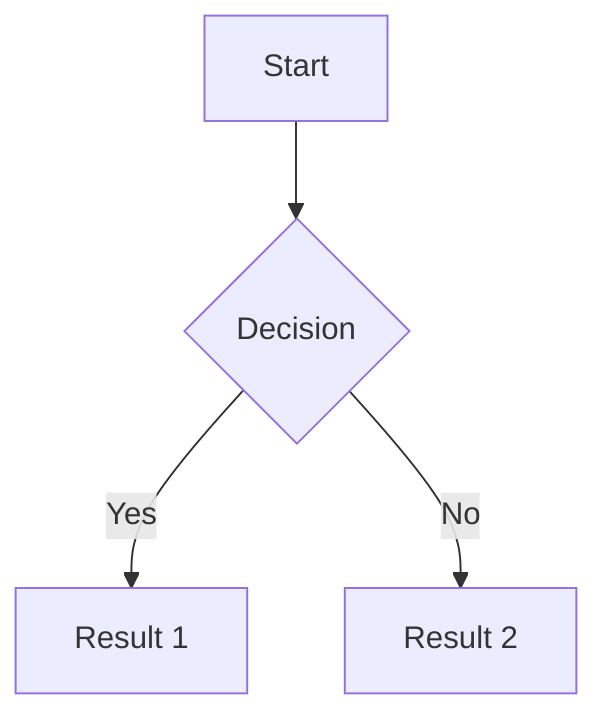

# GitHub Flavored Markdown (GFM) Sample

This document demonstrates various GitHub Flavored Markdown features along with some commonly used HTML elements.

## Text Formatting

**Bold text** and _italic text_ or **_bold and italic_**  
~~Strikethrough~~ and `inline code`

## Headers

# H1 Header

## H2 Header

### H3 Header

#### H4 Header

##### H5 Header

###### H6 Header

## Lists

### Unordered List

- Item 1
- Item 2
  - Nested item 2.1
  - Nested item 2.2
- Item 3

### Ordered List

1. First item
2. Second item
   1. Nested item 2.1
   2. Nested item 2.2
3. Third item

### Task List

- [x] Completed task
- [ ] Incomplete task
- [ ] Another task

## Links and Images

[Regular link](https://github.com)  
[Link with title](https://github.com "GitHub Homepage")

  


## Code

### Inline Code

Use `console.log('Hello World')` for debugging.

### Code Blocks with Syntax Highlighting

```javascript
function greet(name) {
  return `Hello, ${name}!`;
}
console.log(greet("World"));
```

```python
def greet(name):
    return f"Hello, {name}!"

print(greet("World"))
```

```html
<!DOCTYPE html>
<html>
  <head>
    <title>Sample Page</title>
  </head>
  <body>
    <h1>Hello World</h1>
  </body>
</html>
```

## Tables

| Header 1 | Header 2   | Header 3  |
| -------- | ---------- | --------- |
| Cell 1   | Cell 2     | Cell 3    |
| Cell 4   | Cell 5     | Cell 6    |
| Left     | Center     | Right     |
| :------- | :--------: | --------: |

## Blockquotes

> This is a blockquote
>
> With multiple lines
>
> > And nested blockquotes

## Horizontal Rules

---

---

---

## Emoji

:smile: :sparkles: :rocket: :octocat: :heart:

You can use emoji shortcuts like :+1: or :-1:

## Mentions and References

@username - Mention a user  
#123 - Reference an issue or pull request  
org/repo#123 - Reference an issue in another repository

## Strikethrough

~~This text is crossed out~~ while this is not.

## Automatic URL linking

Visit https://github.com for more information.

## HTML Elements

### Details/Summary (Collapsible Section)

<details>
<summary>Click to expand</summary>

This content is hidden until you click the summary.

```javascript
// You can put code here too
const hiddenCode = "This was hidden!";
```

</details>

<details>
<summary>More information about GFM</summary>

### Additional Features

- **Automatic linking for URLs**: https://github.com
- **Task lists** in issues and PRs
- **Tables** with alignment options
- **SHA references**: Commit references like d6b5d5c become links
- **Issue references**: #1, USER/REPO#1

</details>

### HTML Table with Advanced Styling

<table style="width:100%">
  <tr style="background-color: #f6f8fa">
    <th>Feature</th>
    <th>Support</th>
    <th>Notes</th>
  </tr>
  <tr>
    <td>Tables</td>
    <td>✅</td>
    <td>With alignment support</td>
  </tr>
  <tr>
    <td>Syntax highlighting</td>
    <td>✅</td>
    <td>For 200+ languages</td>
  </tr>
</table>

### Custom HTML

You can also use <span style="color: red;">inline HTML</span> for custom styling.

<center>
This text is centered using HTML
</center>

## Footnotes

Here's a sentence with a footnote.[^1]

[^1]: This is the footnote content.

## Math Support (with LaTeX)

When $a \ne 0$, there are two solutions to $(ax^2 + bx + c = 0)$:

$$
x = {-b \pm \sqrt{b^2-4ac} \over 2a}
$$

## Mermaid Diagrams (GitHub Support)



## Keyboard Shortcuts

Use <kbd>Ctrl</kbd> + <kbd>C</kbd> to copy text.

## Highlighting

==This text is highlighted== (GFM extension)

## Comments

<!-- This is a comment that won't be visible in the rendered output -->

## Special References

- Commit: `d6b5d5c`
- Issue: #123
- User: @github

---

_This sample demonstrates most GitHub Flavored Markdown features. Note that some features like Mermaid diagrams and math rendering may require specific repository settings or GitHub Pages configuration._
