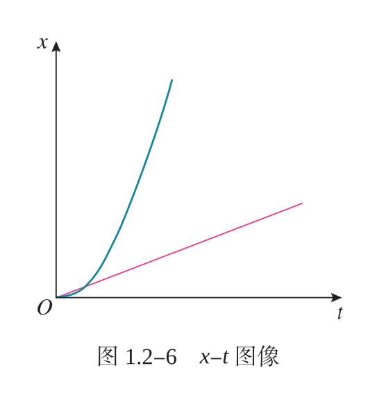

## chapter 1

### 质点

> 研究运动,
>
> 有时只关心物体整体运动, 其大小和形状忽略不计.
>
> 有时物体上各点的运动情况完全相同.
>
> 这时候, 物体可以被视为质点.

> 导航软件利用定位系统可以实时显示对象的位置, 想一想, 无论是人或车, 通常都是用一个点表示所在位置, 为什么可以这么做呢？

- `质点` 有质量的点, 忽略大小和形状

> 为什么要保留质量?

因为质量是影响运动的重要因素.

物体的惯性与质量有关.

> 什么时候可以忽略大小和形状, 什么时候不可以?

- 只关心物体整体运动, 其大小和形状忽略不计
  - 列车过桥时间, 加上列车长, 影响很大
  - 列车从上海到北京, 列车长忽略不计
- 物体上各点的运动情况完全相同

> 哪一点可以反映物体整体运动?

- 小车行驶
  - 车头取一点, 可以
  - 车尾取一点, 可以
  - 车轮子中心, 可以.
  - 车轮子边缘上取一点, 不可以.

> 哪一点更可以反映物体整体运动?

- 若在车轮子上取一点, 越靠近中心越能
  - (打点图片)
- 老鹰飞行, 老鹰头, 身体, 更能. 翅膀不好.
  - (打点图片)

> 质点是一种理想模型. 建立理想模型, 目的是突出事物的主要因素, 忽略次要因素. 从而抓住问题本质, 发现规律.

- 思想方法: `理想模型`

### 参考系

> 开车, 看乘客, 乘客仿佛没动. 在地上看着乘客, 乘客仿佛动了.
>
> 物体的位置有相对性, 所以描述物体的运动要选择参照物.

- `参考系` 即参照物

> 通常情况下, 在讨论地面上物体的运动时, 都以地面为参考系。

### 时间与时刻

> 什么是时间间隔, 什么是时刻?

- 比赛还剩 2min `时间间隔`
- 学生早上 6 点起床 `时刻`
- 照片曝光时间 $\frac{1}{500}$ s `时间间隔`

> 这些常用术语里面, 哪些是时间间隔, 哪些是时刻?

- 前 3s `0~3`
- 第 3s `2~3`
  - (时间轴上数一数?)
- 第 3s 末 `3`
- 第 3s 初 `2`
- 第 3s 中间时刻 `2.5`

> 其实, 第 2s 末, 就是第 3s 初.

> 日常生活中所说的 "时间", 有时指时刻, 有时指时间间隔.

### 位置, 位移, 路程

> 为了定量地描述物体的位置, 需要在参考系上建立适当的坐标系

- 人在地面上的位置, 可以采用平面直角坐标系来描述
- 做直线运动的物体, 可以用一维坐标系来描述

> 什么是路程, 什么是位移?
>
> 
>
> 一个人从 A 点到 B 点, 走了 C 这条路.

- `路程` 运动轨迹的 **长度**
  - 大小: C 的长度
- `位移` 起点到终点的 **有向线段**
  - 大小: 线段 AB 的长度 (A, B 的直线距离)
  - 方向: 从 A 到 B

> 显然, 路程的大小一定不小于位移的大小

> 像位移这样的物理量叫作矢量, 它既有大小又有方向. 像温度、路程这样的物理量叫作标量, 它们只有大小, 没有方向。

- `矢量` 大小和方向
- `标量` 只有大小, 没有方向

#### 位移的表示, x-t 图像

> 在一维坐标系中位移应该如何表示呢？

$\Delta x = x_2 - x_1$

> 如何理解位移的正, 负号?

位移的大小, 是两坐标之差的绝对值.

若位移为正, 则其方向为 x 轴的正方向. 若为负, 则方向为负方向。

> 物体在每一时刻的位置 (或每一时间间隔的位移), 可以用图像直观地表示。

> 显然, 如果是一条直线, 那它在做匀速直线运动.

- `匀速直线运动`
  - 任取相等时间, 位移都相同.
  - 任意时刻的瞬时速度 = 平均速度.

> 匀速直线运动是理想模型, 现实中, 如果物体的运动与其相近, 就可以视为匀速直线运动.

> 如何测量位移和时间的关系 (测得 x-t 图像)?

可以使用打点计时器. 或者数字传感器 "DIS" 系统 (digital infomation system)

(todo)

### 速度

> 速度表示运动和快慢.

- `速度` **位移** 与 (发生这段位移所用) 时间之比
  - 符号: $v$ (velocity)

$v = \frac{\Delta x}{\Delta t}$

> ![note]
>
> 在国际单位制中, 速度的单位是米每秒, 符号是 $m/s$ 或 $m \cdot s^{-1}$ 。 常用的单位还有千米每时（$km/h$ 或 $km \cdot h^{-1}$ ）、厘米每秒（$cm/s$ 或 $cm \cdot s^{-1}$ ）等。

> ![warning]
>
> 速度是矢量. (或许与之前所学不同, 之前速度的定义可能是路程时间之比, 现在是位移时间之比)

#### 平均速度, 瞬时速度

> 当 $\Delta t$ 较大时, 速度表示的是这段时间内的平均快慢程度, 即平均速度.

平均速度只能粗略地描述一个物体运动的快慢, 忽略了这段时间速度的变化.

当我们用平均速度描述一个物体的运动, 就相当于, 这个物体在这段时间内在做匀速直线运动.

使用了等效替代方法 ("相当于").

> 警察: 你开了 70km/h 超速了. 司机: 我才开了 7 分钟, 怎么可能达到 70km 呢.

> 有时, 我们想研究物体某个时刻的快慢, 将 $\Delta t$ 取得很小, 即瞬时速度. 有时也称为速率.

"将 $\Delta t$ 取得很小", 使用了极限方法.

- `速率` 瞬时速度的大小
  - 标量

> 日常生活中的 "速度", 有时指平均速度 (比如马拉松成绩), 有时指瞬时速度 (比如汽车限速).

#### 速度与时间的关系, v-t 图像

(todo)

#### 速度变化的快慢, 加速度

> 一辆小汽车在 10 s 内, 速度从 0 达到 100 km/h, 一列火车在 300 s 内速度也从 0 达到 100 km/h。虽然汽车和火车速度都从 0 达到 100 km/h, 但是它们的运动情况显然不同。你觉得用“速度大”或“速度变化大”能描述这种不同吗？如果不能, 应该怎样描述呢？

- `加速度` 速度的变化量与发生这一变化所用时间之比
  - 符号: $a$ (acceleration)

$a = \frac{\Delta v}{\Delta t}$

> 根据公式, 加速度是矢量.

> ![note]
>
> 在国际单位制中, 加速度的单位是米每二次方秒, 符号是 $m/s^2$ 或 $m \cdot s^{-2}$ 。加速度是矢量

> 由 v-t 图像中图线的倾斜程度可以判断加速度的大小

