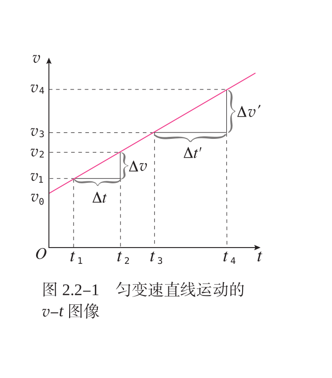

## chapter 2

> 匀变速直线运动的研究

### 匀变速直线运动

> 匀变速直线运动, v-t 图像是一条倾斜的直线。

> 匀变速直线运动中, 速度与时间有什么关系?

> 令由 0 时刻到 t 时刻的时间间隔 $\Delta t$ 为 t, 并将 $\Delta v = v - v_0$ 带入 $a = \frac{\Delta v}{\Delta t}$, 可得

$v = v_0 + at$

> 匀变速直线运动中, 位移与时间有什么关系?

> 注意到, 位移大小, 正好等于 v-t 图像梯形面积 (为什么?)
> 
> $x = \frac{1}{2} (v_0 + v) t$
> 
> 将 $v = v_0 + at$ 代入, 可得

$x = v_0t + \frac{1}{2} at^2$

